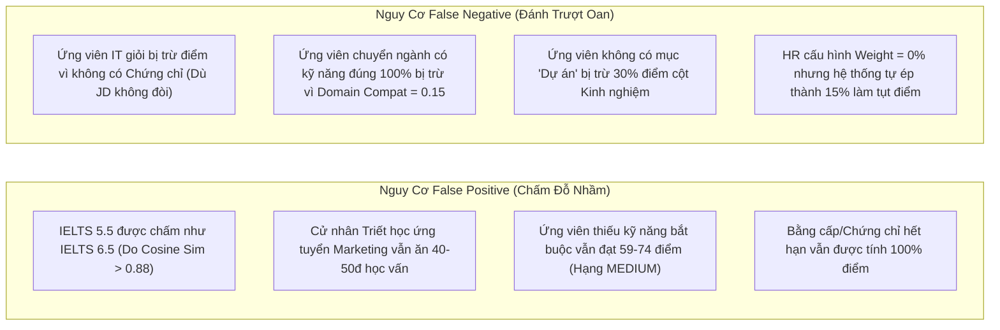

# BÁO CÁO TOÀN DIỆN VỀ HỆ THỐNG CHẤM ĐIỂM & KHỚP HỒ SƠ (CV ↔ JD)
**Hệ thống Tuyển dụng Trí tuệ Nhân tạo – AI Recruitment System (DATN)**  
*Kiểm toán viên: Senior AI Engineer + Backend Engineer + ML System Architect*  
*Ngày kiểm toán: 16/09/2026*  
*Phạm vi kiểm toán: Toàn bộ mã nguồn `backend/` (NestJS), `ai-service/` (FastAPI/Python), `frontend/` (Next.js/React) và `prisma/schema.prisma`.*

---

## 1. Executive Summary (Tóm Tắt Điều Hành)

Cuộc audit toàn diện trên toàn bộ codebase cho thấy hệ thống khớp nối CV ↔ JD được thiết kế theo kiến trúc **Hybrid Pipeline (H-CAME V4)**: kết hợp trích xuất thực thể bằng LLM (Google Gemini), so khớp quy tắc kết hợp Vector Embedding (`XuanTruong03/ai-recruitment-embedder-v3`), cùng bộ công cụ lọc ngữ cảnh (Context / Taxonomy / Gating).

Tuy nhiên, hệ thống chấm điểm hiện tại bộc lộ **nhiều sai lệch kiến trúc nghiêm trọng giữa thiết kế cơ sở dữ liệu, API, dịch vụ AI và giao diện người dùng**, đặc biệt là trong việc xử lý **Ngoại ngữ, Chứng chỉ, Bậc học vấn và Rào cản bắt buộc (Mandatory Gates)**:

1. **4 Tiêu chí Chấm điểm Thực tế**:
   * **Kỹ năng (Skills)**: Chấm qua `_match_skills` (khớp ID/tên, tương đồng semantic embedding, chuyển giao theo cụm `_is_transferable_skill`, và bối cảnh kinh nghiệm).
   * **Kinh nghiệm (Experience)**: Chấm qua `_match_experience` (tổng số năm sau khi gộp trùng lặp, mức độ tương đồng chức danh, cấp bậc quản lý, và **30% điểm lấy từ Dự án `_eval_projects`**).
   * **Học vấn (Education)**: Chấm qua `_match_education` (so khớp ngữ nghĩa giữa tên ngành học `major` và mô tả JD, **hoàn toàn bỏ qua bậc học Degree**).
   * **Chứng chỉ / Ngoại ngữ (Certification & Language)**: Trên thực tế, tiêu chí này trong code AI được thực thi bởi hàm `_match_certificates`. **Hệ thống hoàn toàn KHÔNG CÓ logic chấm điểm Ngoại ngữ (Language)**; ngoại ngữ bị bỏ rơi hoàn toàn ở tầng Backend và AI Service, dù Frontend vẫn hiển thị mục "Ngoại ngữ / Chứng chỉ".
2. **Cơ chế Trọng số (Weighting Mechanism)**:
   * Trọng số 4 trụ cột được lưu ở bảng `job_postings` (`skill_weight`, `experience_weight`, `education_weight`, `other_weight`).
   * **Lỗi nghiêm trọng (Critical Bug)**: Backend NestJS khi tạo snapshot gửi sang RabbitMQ sử dụng toán tử JavaScript: `Number(job.skillWeight) || 40`, `Number(job.otherWeight) || 15`... Khi HR cấu hình trọng số một cột bằng `0%`, toán tử `||` coi `0` là falsy và **tự động fallback về giá trị mặc định (40, 30, 15, 15)**. HR **không thể tắt** bất kỳ trụ cột nào.
3. **Cơ chế Yêu cầu Bắt buộc (Mandatory Mechanism)**:
   * **Không có Hard Gate loại trực tiếp**. Dù ứng viên thiếu 100% kỹ năng bắt buộc, thiếu chứng chỉ bắt buộc, hoặc không đủ năm kinh nghiệm, ứng viên vẫn được chấm điểm và tự động chuyển sang trạng thái `SCREENING` với quyết định `CONSIDER`.
   * Thiếu kỹ năng bắt buộc chỉ kích hoạt hàm chặn trần điểm (`_mandatory_score_cap`): nếu tỷ lệ đạt kỹ năng bắt buộc < 40%, điểm tổng bị chặn ở **39.0/100**; từ 40%–60% bị chặn ở **59.0/100**; từ 60%–80% bị chặn ở **74.0/100**. Thiếu chứng chỉ bắt buộc thậm chí **không hề bị cap điểm**.
4. **Sử dụng AI / Embedding / LLM**:
   * **LLM (Gemini 2.5 Flash)**: **CHỈ tham gia duy nhất vào bước phân tích và trích xuất CV thô thành JSON cấu trúc** (`GeminiLLMAdapter.extract`). LLM **không hề** tham gia vào việc chấm điểm hay quyết định đậu/rớt.
   * **Embedding (SentenceTransformer)**: Mô hình `ai-recruitment-embedder-v3` (384 chiều) tính Cosine Similarity cho kỹ năng, chức danh, chuyên ngành, và dự án.
5. **Hiện tượng Tính trùng điểm (Double Counting)**:
   * Dữ liệu **Dự án (Projects)** và **Kinh nghiệm làm việc (Work Experiences)** bị dùng lặp lại nhiều lần: vừa cộng thâm niên cho Kỹ năng, vừa tính điểm trong Kinh nghiệm, vừa tính riêng trong Project Score, vừa quét trong Late Interaction.
   * **Hệ số tương thích ngành (Domain Compatibility)**: Trừ điểm dồn dập 4 lần (trừ điểm Kỹ năng, trừ điểm Context Search, trừ điểm Kinh nghiệm, và trừ điểm Chuyên ngành).

---

## 2. Current Architecture (Kiến Trúc Thực Tế Hệ Thống)

Sơ đồ Mermaid dưới đây phản ánh **chính xác luồng thực thi code hiện tại** giữa NestJS, PostgreSQL/Prisma, RabbitMQ, và Python FastAPI AI Service:

```mermaid
flowchart TD
    subgraph Data_Storage["1. Storage & Database (PostgreSQL / Prisma)"]
        CP[CandidateProfile]
        RPD[ResumeParsedData: languageData JSON]
        JP[JobPosting: weights, skills, certs]
        JS[JobSkill: MANDATORY / PREFERRED]
        JC[JobCertificate: MANDATORY / PREFERRED]
    end

    subgraph Backend_Preparation["2. Backend NestJS (Application Service)"]
        BUILD[buildProfileSnapshot]
        CP -->|Skills, Exps, Edus, Projs, Certs| BUILD
        RPD -.->|BỊ BỎ RƠI: KHÔNG TRÍCH XUẤT LANGUAGE| BUILD
        JP -->|skillWeight, expWeight, eduWeight, otherWeight| BUILD
        W_BUG{"Lỗi JS: Number(weight) || DEFAULT\n(Weight = 0 bị biến thành Default!)"}
        BUILD --> W_BUG
        W_BUG --> MSG[RabbitMQ Message Payload]
    end

    subgraph RabbitMQ_Bus["3. Message Broker"]
        MSG -->|evaluation.requested| EV_QUEUE[evaluation_queue]
    end

    subgraph AI_Service["4. Python AI Service (Generic Matching Engine)"]
        EV_QUEUE --> WORKER[EvaluationConsumer]
        WORKER --> ME[MatchingEngine.evaluate]
        
        ME --> TAX["_detect_subdomain (Regex 14 Ngành / 38 Phân ngành)"]
        TAX --> DOM_COMP["_calc_domain_compatibility (0.15 - 1.0)"]
        
        DOM_COMP --> P1["_match_skills\n(Exact + Semantic + Cluster + Context)"]
        DOM_COMP --> P2["_match_experience\n(0.7 Exp + 0.3 Project Score)"]
        DOM_COMP --> P3["_match_education\n(Semantic Major, Degree bị bỏ qua)"]
        P4["_match_certificates\n(Chỉ Certs, KHÔNG CÓ LANGUAGE)"]
        
        P1 --> RAW_S[Skills Raw: 0.0 - 1.0]
        P2 --> RAW_E[Exp Raw: 0.0 - 1.0]
        P3 --> RAW_ED[Edu Raw: 0.0 - 1.0]
        P4 --> RAW_O[Other Raw: 0.0 - 1.0]
        
        ME --> LATE["late_interaction_scorer (ColBERT MaxSim - Chỉ để log)"]
        ME --> AUDIT["fraud_auditor (Wikidata Timeline - Diagnostic)"]
    end

    subgraph Score_Calculation["5. Score Engine & Gate"]
        RAW_S --> SE[ScoreEngine.calculate]
        RAW_E --> SE
        RAW_ED --> SE
        RAW_O --> SE
        
        SE --> BASE["Base Overall Score = Sum(Component * MaxPoints)"]
        P1 -.->|mandatory_ratio| CAP{"_mandatory_score_cap\nRatio < 0.4: max 39\nRatio < 0.6: max 59\nRatio < 0.8: max 74"}
        BASE --> CAP
        CAP --> FINAL["Final Overall Score (0 - 100)"]
        FINAL --> ALLOC["_allocate_capped_points\n(Scale đều điểm 4 cột)"]
    end

    subgraph Persistence["6. Result Handling"]
        FINAL --> COMP_MSG[evaluation.completed]
        COMP_MSG --> AP_CONS[ApplicationsConsumer (NestJS)]
        AP_CONS -->|Lưu ai_matching_results| DB[(PostgreSQL)]
        AP_CONS -->|Set status: SCREENING, hrDecision: CONSIDER| APP_STAGE[Application: Auto Promotion]
    end
```

---

## 3. Component-by-Component Audit (Kiểm Toán Chi Tiết 4 Trụ Cột)

| Component | Input Thực Tế | Logic Xử Lý Mã Nguồn | Công Thức Tính Điểm Thực Tế | Trọng Số Mặc Định | File & Function Mã Nguồn | Vấn Đề Phát Hiện |
| :--- | :--- | :--- | :--- | :--- | :--- | :--- |
| **1. Kỹ năng (Skills)** | `cand_profile.skills`, `work_experiences`, `projects`, `job.required_skills` | 4 tầng: 1. Khớp mã/tên chính xác; 2. Semantic Embedding (ngưỡng 0.78); 3. Cụm kỹ năng chuyển giao (`_is_transferable_skill`); 4. Bối cảnh kinh nghiệm (`_search_in_context`). Kiểm tra thâm niên kỹ năng qua `_calculate_skill_years`. | $\text{Raw} = 0.75 \times \overline{\text{Mandatory}} + 0.25 \times \overline{\text{Optional}}$<br>$\text{Score} = \text{Raw} \times p_{\text{density}}$<br>với $p_{\text{density}} = \min(1.0, \frac{\text{count}}{\text{len}} \times 1.2)$ | 40% (`skillWeight`) | [generic_matcher.py:L1016](file:///d:/DATN/Ai-Recruitment-System-Test-Deploy/ai-service/app/services/matching/generic_matcher.py#L1016)<br>`_match_skills` | Thiếu kỹ năng vẫn nhận điểm chuyển giao (domain credit); bị trừ điểm lặp lại bởi `domain_compat`; thâm niên kỹ năng bị cộng dồn trùng lặp từ dự án. |
| **2. Kinh nghiệm (Experience)** | `cand_profile.work_experiences`, `projects`, `job.required_experience_years`, `experience_level` | Gộp khoảng thời gian trùng (`_calculate_total_years`). Tính `duration_score` theo hàm luỹ thừa/tỷ lệ. Tính `relevance_score` qua chức danh + domain. Tính `project_score` qua `_eval_projects`. | $\text{Exp} = 0.5 \times \text{Duration} + 0.5 \times \text{Relevance}$<br>$\text{Final} = 0.7 \times \text{Exp} + 0.3 \times \text{Project}$<br>(Nếu không có KN: mặc định 0.2) | 30% (`experienceWeight`) | [generic_matcher.py:L1803](file:///d:/DATN/Ai-Recruitment-System-Test-Deploy/ai-service/app/services/matching/generic_matcher.py#L1803)<br>`_match_experience` | Trộn 30% điểm Dự án vào Kinh nghiệm dù DB không có cấu hình; ứng viên 0 năm kinh nghiệm vẫn được sàn 20 điểm (0.2). |
| **3. Học vấn (Education)** | `cand_profile.educations` (`major`), `job.title`, `job.description` | Bỏ qua trường `degree`. Chỉ lấy danh sách `major`, ghép prompt: `"Cử nhân {major}"` so khớp Cosine Similarity với `"Tuyển dụng {job.title}"`. | $\text{Score} = 0.40 + (0.60 \times \text{best\_sim})$<br>(Nếu không có học vấn: trả về 0.20) | 15% (`educationWeight`) | [generic_matcher.py:L1946](file:///d:/DATN/Ai-Recruitment-System-Test-Deploy/ai-service/app/services/matching/generic_matcher.py#L1946)<br>`_match_education` | **Không kiểm tra phân cấp bằng cấp** (High School vs PhD bằng nhau); luôn cho sẵn 40% điểm sàn dù ngành học hoàn toàn không liên quan. |
| **4. Chứng chỉ / Ngoại ngữ** | `cand_profile.certificates`, `job.required_certificates` | Chỉ duyệt danh sách chứng chỉ. Khớp chuỗi con hoặc Cosine Similarity. Ngưỡng > 0.8: 1.0 điểm; > 0.6: cộng `best_sim`. **BỎ QUA NGOẠI NGỮ HOÀN TOÀN**. | $\text{Score} = \frac{\sum \text{cert\_sim}}{\text{len}(\text{req\_certs})}$<br>(Nếu JD không yêu cầu cert: Có cert = 1.0, Không có cert = 0.8) | 15% (`otherWeight`) | [generic_matcher.py:L2051](file:///d:/DATN/Ai-Recruitment-System-Test-Deploy/ai-service/app/services/matching/generic_matcher.py#L2051)<br>`_match_certificates` | **Không có logic so khớp Ngoại ngữ**; phạt 80% ứng viên không có cert dù JD không hề yêu cầu cert; không kiểm tra hạn dùng cert. |

---

## 4. Certification & Language Detailed Audit (Kiểm Toán Ngoại Ngữ & Chứng Chỉ)

Mặc dù hệ thống gom chung thành một nhóm trọng số (`otherWeight` / `projectScore`), bản chất dữ liệu của 2 phần này hoàn toàn khác nhau:

| Sub-component | Identity Matching | Level / Score Evaluation | Evidence Verification | Matching Pipeline Thực Tế | Điểm & Xử Lý Hiện Tại |
| :--- | :--- | :--- | :--- | :--- | :--- |
| **4.1 Certification** | Khớp chuỗi con `in` không phân biệt hoa thường hoặc Vector Cosine Similarity. | **Không đánh giá Level**. Không phân biệt AWS Associate vs AWS Professional. | Lấy từ `issuing_organization`, `credential_url` (nhưng **không kiểm tra validity / expiry_date**). | Chạy qua vòng lặp `for req in req_certs` trong `_match_certificates`. Ngưỡng: >0.8 = 1.0; >0.6 = sim; <=0.6 = 0. | Tính trung bình cộng các cert yêu cầu. Nếu JD không yêu cầu cert: ứng viên có cert = 1.0, không có = 0.8. |
| **4.2 Language** | **KHÔNG TỒN TẠI**. Không có bảng, model hay field so khớp danh tính ngôn ngữ (English vs Japanese). | **KHÔNG TỒN TẠI**. Không có bộ chuyển đổi CEFR, IELTS, TOEIC, JLPT, HSK. | Dữ liệu nằm chết trong JSON `resume_parsed_data.language_data`, không được trích xuất sang bảng quan hệ. | **KHÔNG CÓ PIPELINE**. Nếu HR nhập "IELTS 6.5" vào bảng `JobCertificate`, hệ thống coi đó là một chuỗi chứng chỉ chung chung và so sánh vector embedding! | Điểm số của Ngoại ngữ phụ thuộc 100% vào việc HR có điền yêu cầu vào bảng Chứng chỉ hay không. Nếu điền, Cosine Similarity sẽ làm việc sai lệch. |

---

## 5. Education Decision Matrix (Ma Trận Quyết Định Học Vấn)

Dưới đây là ma trận quyết định thực tế của hàm `_match_education` ([generic_matcher.py:L1946](file:///d:/DATN/Ai-Recruitment-System-Test-Deploy/ai-service/app/services/matching/generic_matcher.py#L1946)):

| JD Requirement | Candidate Profile | Level Code Check | Field / Major Check | Kết Quả Thực Tế | Điểm Thành Phần (0 - 100) | Giải Trình Mã Nguồn |
| :--- | :--- | :---: | :---: | :---: | :---: | :--- |
| **Bachelor - Marketing** | Bachelor - Marketing | Bị bỏ qua | Khớp chính xác | **PASS** | **~94 - 100** | Prompt `"Cử nhân Marketing"` khớp vector cao với `"Tuyển dụng Marketing"` ($\text{sim} \approx 0.90 - 1.0$). $\text{Score} = 0.4 + 0.6 \times \text{sim}$. |
| **Bachelor - Marketing** | Master - Marketing | Bị bỏ qua | Khớp chính xác | **PASS** | **~94 - 100** | Code ép cứng `"Cử nhân {major}"`, bỏ qua chữ "Master". Kết quả ra điểm **y hệt** như ứng viên chỉ có Bachelor. |
| **Bachelor - Marketing** | Master - Accounting | Bị bỏ qua | Khác ngành | **PARTIAL** | **~52 - 58** | Accounting vs Marketing có Cosine Similarity $\approx 0.20 - 0.30$. $\text{Score} = 0.4 + (0.6 \times 0.25) \approx 0.55$ (55 điểm). Ứng viên vẫn đỗ vớt học vấn. |
| **Bachelor** (không ghi ngành) | Master (không ghi ngành) | Bị bỏ qua | Rỗng (`None`) | **FAIL / FLOOR** | **20.0** | Dòng 1960: `majors = [e.major for e in educations if e.major]`. Nếu không có `major`, code trả ngay `score: 0.2` (20 điểm) dù có bằng Master! |
| **Bachelor - Marketing** | Education Missing | Rỗng | Rỗng | **MISSING** | **20.0** | Dòng 1950: `if not educations: return {"score": 0.2}`. Mặc định nhận 20 điểm. |

---

## 6. Language Decision Matrix (Ma Trận Quyết Định Ngoại Ngữ)

Do hệ thống không có module Language riêng, nếu HR đưa yêu cầu Ngoại ngữ vào `JobCertificate`:

| JD Requirement | CV Candidate | Language Identity Match? | Level Comparison? | Kết Quả Xử Lý Thực Tế | Rủi Ro / Nhận Xét |
| :--- | :--- | :---: | :---: | :---: | :--- |
| **English IELTS 6.0** | English IELTS 6.5 | Ngẫu nhiên qua text | Không có | **PASS (100 đ)** | Chuỗi `"English IELTS 6.0"` và `"IELTS 6.5"` có chứa cụm `"ielts"`, hoặc Cosine Similarity > 0.80 nên ăn trọn 1.0 điểm. |
| **English IELTS 6.0** | English IELTS 5.5 | Ngẫu nhiên qua text | Không có | **FALSE POSITIVE (100 đ)** | Model embedding MiniLM coi `"IELTS 6.0"` và `"IELTS 5.5"` có độ tương đồng ngữ nghĩa > 0.88. Hệ thống chấm **100/100 điểm**, không hề biết ứng viên bị thiếu 0.5 điểm chuẩn! |
| **English IELTS 6.0** | Japanese JLPT N2 | **SAI LỆCH NGHIÊM TRỌNG** | Không có | **FALSE POSITIVE HOẶC PARTIAL** | Hai chứng chỉ khảo thí ngoại ngữ có Cosine Sim từ **0.62 – 0.75**. Dòng 2091: `elif best_sim > 0.6: score_sum += best_sim`. Hệ thống cho ăn điểm một phần (~65 - 75 điểm) dù sai ngôn ngữ! |
| **English Required** | Missing | Không kiểm tra | Không có | **FAIL / FLOOR (20 đ)** | Nếu candidate không có chứng chỉ nào, trả về `score: 0.2`. |

---

## 7. Certification Decision Matrix (Ma Trận Quyết Định Chứng Chỉ)

| JD Requirement | Candidate CV | Phân Loại Quan Hệ | Độ Tương Đồng Tính Được | Kết Quả Phán Quyết | Điểm Nhận Được |
| :--- | :--- | :---: | :---: | :---: | :---: |
| **CPA** | CPA | Khớp chính xác | Substring = 1.0 | **PASS** | 100% (1.0) |
| **CPA** | ACCA / CIMA (Kế toán liên quan) | Liên quan cùng ngành | Cosine Sim $\approx 0.65 - 0.75$ | **PARTIAL MATCH** | $65\% - 75\%$ (Bằng chính `best_sim`) |
| **CPA** | Google Digital Marketing Cert | Hoàn toàn không liên quan | Cosine Sim $< 0.40$ | **MISSING** | 0% (0.0) |
| **CPA (Mandatory)** | Missing | Thiếu | 0.0 | **MISSING** | 20% (Điểm sàn nếu không có cert) |

*Ghi chú*: Điểm của Cert sau khi tính sẽ nhân với `otherWeight` (15%). Ứng viên thiếu CPA bắt buộc vẫn có thể đạt 85/100 điểm tổng nếu 3 cột còn lại hoàn hảo.

---

## 8. Weight Analysis (Phân Tích Cơ Chế Trọng Số)

### Cấu hình Hiện tại
* **Skill Weight**: Mặc định `40.0%`
* **Experience Weight**: Mặc định `30.0%`
* **Education Weight**: Mặc định `15.0%`
* **Certification/Language Weight (`otherWeight`)**: Mặc định `15.0%`

### Nguồn Dữ liệu & Lưu trữ
* **Database**: `prisma/schema.prisma` (bảng `job_postings`, các cột `skill_weight`, `experience_weight`, `education_weight`, `other_weight`). Kiểu `Decimal(5, 2)`.
* **API / DTO**: Tuyển dụng cấu hình qua `CreateJobWizard.tsx` và gửi về NestJS `JobsController`.
* **Config Snapshots**: NestJS đóng gói vào JSON snapshot gửi RabbitMQ sang Python AI Service.

### Rủi ro Phép tính Trọng số (Mathematical Edge Cases)
1. **Tổng trọng số khác 100%**:
   * Frontend có validate cảnh báo đỏ nếu $\sum \neq 100$ ([CreateJobWizard.tsx:L631](file:///d:/DATN/Ai-Recruitment-System-Test-Deploy/frontend/src/components/recruiter/CreateJobWizard.tsx#L631)).
   * Tuy nhiên, nếu API nhận được $\sum \neq 100$ (ví dụ: tổng = 80 hoặc tổng = 140), code Python tại `ScoreEngine.calculate` ([score_engine.py:L70-73](file:///d:/DATN/Ai-Recruitment-System-Test-Deploy/ai-service/app/services/matching/score_engine.py#L70-73)) tự động chuẩn hoá lại theo tỷ lệ:
     $$\text{max\_skills} = \text{round}\left(\frac{\text{weights}['\text{skills}']}{\text{total\_weight}} \times 100.0, 1\right)$$
     Do đó, tổng < 100 hay > 100 đều được đưa về hệ cơ số 100 điểm một cách an toàn.
2. **Tất cả trọng số = 0%**:
   * Tại [score_engine.py:L66](file:///d:/DATN/Ai-Recruitment-System-Test-Deploy/ai-service/app/services/matching/score_engine.py#L66): `if total_weight <= 0: total_weight = 100.0`.
   * Khi đó $\text{max\_skills} = 0 / 100 \times 100 = 0$. Mọi điểm thành phần = 0, `FinalScore = 0.0`.
3. **Giá trị Null / Undefined**:
   * Hàm `_resolve_weights` ([score_engine.py:L187](file:///d:/DATN/Ai-Recruitment-System-Test-Deploy/ai-service/app/services/matching/score_engine.py#L187)) fallback về `{skills: 40.0, experience: 30.0, education: 15.0, other: 15.0}`.
4. **Số âm (Negative weight)**:
   * Prisma schema dùng kiểu `Decimal(5, 2)` không có ràng buộc `CHECK (weight >= 0)`. Nếu bị truyền số âm, công thức tính toán sẽ bị sai lệch nghiêm trọng.

---

## 9. Trường Hợp Trọng Số = 0% (Weight = 0% Audit)

### Lỗi Nghiêm Trọng tại Tầng Backend Snapshot
Tại [backend/src/modules/applications/applications.service.ts:L867-870](file:///d:/DATN/Ai-Recruitment-System-Test-Deploy/backend/src/modules/applications/applications.service.ts#L867-L870):
```typescript
const weights = {
  skills: Number(job.skillWeight) || 40,
  experience: Number(job.experienceWeight) || 30,
  education: Number(job.educationWeight) || 15,
  other: Number(job.otherWeight) || 15,
};
```
* **Hiện tượng**: Trong JavaScript, `Number(0)` trả về `0`, và `0 || 15` trả về `15`.
* **Hậu quả**: Khi Nhà tuyển dụng cố tình đặt `otherWeight = 0` (vì công việc không yêu cầu Ngoại ngữ/Chứng chỉ), Backend **tự ý ghi đè thành 15%** khi gửi sang AI Service!
* **Kết luận**: **Hiện tại hệ thống KHÔNG THỂ loại bỏ bất kỳ tiêu chí nào khỏi Final Score bằng cách đặt trọng số = 0%**.

### Tách biệt giữa `Weight = 0` và `Required = true`
* Trong nghiệp vụ ATS chuẩn: Một tiêu chí có thể có `Weight = 0%` (không tính vào điểm tương thích chung) nhưng `Required = true` (tiêu chí điều kiện tiên quyết, nếu thiếu là Trượt).
* Trong hệ thống hiện tại: **Hai khái niệm này bị nhập nhằng**. Tiêu chí chỉ có tác dụng khi có trọng số. Nếu trọng số = 0, nó không ảnh hưởng điểm; nhưng hệ thống cũng không có cơ chế nào để đánh trượt ứng viên nếu thiếu tiêu chí bắt buộc này.

---

## 10. Mandatory Requirement & Hard Constraint Audit

### Hệ thống có tách riêng Weighted Score và Mandatory Validation không?
* **CÂU TRẢ LỜI: CHƯA TÁCH BIỆT.**
* Trong database có cột `JobPosting.rejectOnMissingMandatory` (default `true`) và `JobSkill.requirementType = 'MANDATORY'`.
* **Tuy nhiên trong luồng thực thi (Execution Flow)**:
  1. Khi nhận kết quả từ AI, `ApplicationsConsumer` ([applications.consumer.ts:L144-153](file:///d:/DATN/Ai-Recruitment-System-Test-Deploy/backend/src/modules/applications/applications.consumer.ts#L144-L153)) **tự động thăng cấp tất cả ứng viên** từ `RECEIVED` lên `SCREENING` với quyết định `hrDecision = CONSIDER`.
  2. Cờ `rejectOnMissingMandatory` **hoàn toàn không được gọi đến trong consumer** để tự động từ chối hồ sơ!
  3. Cơ chế duy nhất xử lý bắt buộc là **Trần điểm gián tiếp (Score Ceiling Cap)** trong [score_engine.py:L16-26](file:///d:/DATN/Ai-Recruitment-System-Test-Deploy/ai-service/app/services/matching/score_engine.py#L16-L26):
     ```python
     if ratio >= 0.80: return None
     if ratio >= 0.60: return 74.0
     if ratio >= 0.40: return 59.0
     return 39.0
     ```
  4. **Nghịch lý**: Ứng viên thiếu 50% kỹ năng cốt lõi vẫn có thể đạt điểm **59.0/100** (xếp loại `MEDIUM`). Điểm này cao hơn ngưỡng reject thông thường, gây hiểu lầm cho HR rằng ứng viên "tạm ổn".

---

## 11. Embedding & Cosine Similarity Audit

* **Mô hình triển khai**: `XuanTruong03/ai-recruitment-embedder-v3` (dựa trên kiến trúc SentenceTransformers, độ dài vector $D = 384$).
* **Nơi tính toán**: [semantic.py:L194-200](file:///d:/DATN/Ai-Recruitment-System-Test-Deploy/ai-service/app/services/matching/semantic.py#L194-L200).
* **Công thức Cosine Similarity**:
  $$\text{CosineSim}(\vec{u}, \vec{v}) = \frac{\vec{u} \cdot \vec{v}}{\|\vec{u}\|_2 \|\vec{v}\|_2}$$
  Được clamp trong đoạn $[0.0, 1.0]$.
* **Lỗi Diễn Giải Điểm Số (False Calibration)**:
  * Trong `generic_matcher.py` (L1173):
    `f"AI nhận diện kỹ năng tương đương (Độ khớp: {best_sem_score * 100:.1f}%)"`
  * **Vấn đề AI/ML**: Cosine Similarity của các mô hình embedding dạng BERT/MiniLM thường phân bổ trong khoảng $[0.40, 0.95]$. Khoảng cách Cosine **không phải là xác suất (Probability)** và **không phải là phần trăm tương thích thực tế (Compatibility Percentage)**. Việc lấy thẳng $\text{CosineSim} \times 100$ để hiển thị thành "% độ khớp" cho HR mà không qua hàm chuẩn hoá hiệu chuẩn (Temperature Scaling / Sigmoid Calibration) là một sai lầm phổ biến trong ML, tạo ra cảm giác chính xác giả tạo.

---

## 12. LLM Audit (Mô Hình Ngôn Ngữ Lớn)

* **Model**: Google Gemini (`gemini-2.5-flash` cấu hình qua biến môi trường `LLM_MODEL`).
* **Vai trò**: Trích xuất dữ liệu phi cấu trúc từ file CV PDF/Docx thành thực thể JSON (`LLMResumeExtraction`).
* **File thực thi**: [ai-service/app/adapters/gemini_llm.py](file:///d:/DATN/Ai-Recruitment-System-Test-Deploy/ai-service/app/adapters/gemini_llm.py).
* **Khẳng định**: **LLM HOÀN TOÀN KHÔNG CHẤM ĐIỂM TRỰC TIẾP**. Toàn bộ điểm số được quyết định bởi mã nguồn Python (`ScoreEngine`, `GenericMatchingEngine`).

---

## 13. Exact Scoring Formula Reconstructed (Tái Cấu Trúc Công Thức Thực Tế)

Dưới đây là công thức toán học chính xác 100% được trích xuất trực tiếp từ mã nguồn:

### 1. Điểm Kỹ năng thô ($S_{\text{raw}}$)
$$S_{\text{raw}} = \left[ 0.75 \times \left(\frac{1}{M} \sum_{i=1}^{M} s_i^{\text{man}}\right) + 0.25 \times \left(\frac{1}{O} \sum_{j=1}^{O} s_j^{\text{opt}}\right) \right] \times \min\left(1.0, \frac{|\text{Skills}_{\text{unique}}|}{|\text{Skills}_{\text{total}}|} \times 1.2\right)$$
Trong đó điểm mỗi kỹ năng $s_i$ phụ thuộc vào tầng khớp:
* Khớp chính xác: $1.0 \times \min\left(1.0, \frac{\text{Lvl}_{\text{cand}}}{\text{Lvl}_{\text{req}}}\right) \times (0.5 + 0.5 \times D_{\text{compat}}) \times P_{\text{years}}$
* Khớp semantic: $\text{CosineSim} \times (0.35 + 0.65 \times D_{\text{compat}}) \times \min\left(1.0, \frac{\text{Lvl}_{\text{cand}}}{\text{Lvl}_{\text{req}}}\right) \times P_{\text{years}}$
* Khớp cụm: $0.85 \times \min\left(1.0, \frac{\text{Lvl}_{\text{cand}}}{\text{Lvl}_{\text{req}}}\right)$
* Khớp ngữ cảnh: $\text{Score}_{\text{ctx}} \times (0.2 + 0.8 \times D_{\text{compat}})$

### 2. Điểm Kinh nghiệm thô ($E_{\text{raw}}$)
$$E_{\text{raw}} = 0.70 \times \left(0.50 \times D_{\text{score}} + 0.50 \times R_{\text{score}}\right) + 0.30 \times \text{Project}_{\text{score}}$$
Với:
* $D_{\text{score}} = \begin{cases} \min(1.0, \text{Ratio}) & \text{nếu } \text{Ratio} \ge 0.6 \\ \max(0.1, \text{Ratio}^{1.3}) & \text{nếu } \text{Ratio} < 0.6 \end{cases}$ (với $\text{Ratio} = \frac{\text{TotalYears}}{\text{ReqYears}}$)
* $R_{\text{score}} = 0.60 \times \text{Sim}_{\text{title}} + 0.40 \times (0.30 + 0.70 \times D_{\text{compat}})$

### 3. Điểm Học vấn thô ($ED_{\text{raw}}$)
$$ED_{\text{raw}} = 0.40 + \left(0.60 \times \max_{m \in \text{Majors}} \text{CosineSim}(J_{\text{edu\_ctx}}, C_{\text{edu\_ctx}})\right)$$

### 4. Điểm Chứng chỉ/Khác thô ($O_{\text{raw}}$)
$$O_{\text{raw}} = \frac{1}{K} \sum_{k=1}^{K} c_k \quad \text{với } c_k = \begin{cases} 1.0 & \text{nếu } \text{Sim} \ge 0.8 \\ \text{Sim} & \text{nếu } 0.6 \le \text{Sim} < 0.8 \\ 0.0 & \text{nếu } \text{Sim} < 0.6 \end{cases}$$

### 5. Điểm Tổng hợp Cơ sở ($\text{BaseOverall}$)
$$\text{MaxPoints}_p = \text{round}\left(\frac{W_p}{\sum W} \times 100.0, 1\right) \quad \forall p \in \{S, E, ED, O\}$$
$$\text{BaseOverall} = \min\left(100.0, \max\left(0.0, \sum_{p} \text{round}(p_{\text{raw}} \times \text{MaxPoints}_p, 2)\right)\right)$$

### 6. Điểm Tổng kết Cuối cùng ($\text{FinalOverall}$)
$$\text{MandatoryCap} = \begin{cases} \text{None} & \text{nếu } \text{Ratio}_{\text{man}} \ge 0.80 \\ 74.0 & \text{nếu } 0.60 \le \text{Ratio}_{\text{man}} < 0.80 \\ 59.0 & \text{nếu } 0.40 \le \text{Ratio}_{\text{man}} < 0.60 \\ 39.0 & \text{nếu } \text{Ratio}_{\text{man}} < 0.40 \end{cases}$$
$$\mathbf{\text{FinalOverall} = \begin{cases} \min(\text{BaseOverall}, \text{MandatoryCap}) & \text{nếu } \text{MandatoryCap} \neq \text{None} \\ \text{BaseOverall} & \text{ngược lại} \end{cases}}$$

---

## 14. Score Range & Boundary Conditions

| Tiêu Chí | Min | Max | Cơ Chế Chặn / Clamp | Weight |
| :--- | :---: | :---: | :--- | :---: |
| **Kỹ năng** | 0.00 | 100.00 | Clamp theo $\text{MaxPoints}_S$ (mặc định 40đ) | 40% |
| **Kinh nghiệm** | 10.00 | 100.00 | Không bao giờ về 0; tối thiểu 10% do hàm duration/exp sàn | 30% |
| **Học vấn** | **20.00 / 40.00** | 100.00 | Nếu có bằng bất kỳ: tối thiểu 40.00đ; rỗng: 20.00đ | 15% |
| **Chứng chỉ** | **20.00 / 80.00** | 100.00 | Nếu JD không yêu cầu: sàn 80.00đ; nếu thiếu: sàn 20.00đ | 15% |
| **Final Score** | **0.00** | **100.00** | Bị giới hạn bởi `_mandatory_score_cap` khi thiếu kỹ năng | **100%** |

---

## 15. Double Counting Audit (Hiện Tượng Tính Trùng Điểm)

| Evidence Thực Tế | Nơi Xuất Hiện 1 | Nơi Xuất Hiện 2 | Nơi Xuất Hiện 3 | Mức Độ Rủi Ro & Ảnh Hưởng |
| :--- | :--- | :--- | :--- | :--- |
| **Dự án thực tế (Projects)** | `_search_in_context` (Cộng điểm tìm thấy kỹ năng) | `_calculate_skill_years` (Cộng dồn số tháng kinh nghiệm kỹ năng) | `_eval_projects` (Chiếm 30% tổng điểm cột Kinh nghiệm) | **NGHIÊM TRỌNG**: Một dự án sinh viên kéo dài 3 tháng có thể giúp ăn trọn điểm kỹ năng, thổi phồng thâm niên kỹ năng, và kéo điểm kinh nghiệm lên cao. |
| **Kinh nghiệm làm việc (Work Experience)** | `_calculate_total_years` (Tính tổng thời gian kinh nghiệm) | `_search_in_context` (Được trích xuất để chứng minh kỹ năng) | `_calculate_skill_years` (Tính thâm niên cho từng công nghệ) | **TRUNG BÌNH**: Đây là hành vi chấp nhận được trong ATS nhưng cần tách rõ giữa "Thời gian làm việc" và "Mức độ thuần thục". |
| **Độ tương thích ngành (Domain Compatibility)** | Giảm điểm Kỹ năng trực tiếp ($\times (0.5 + 0.5 \times D)$) | Giảm điểm Tìm kiếm bối cảnh ($\times (0.2 + 0.8 \times D)$) | Giảm điểm Chức danh Kinh nghiệm ($\times (0.3 + 0.7 \times D)$) | **RẤT CAO**: Gây ra hiện tượng "Phạt đa tầng" (Cascading Penalty). Ứng viên trái ngành nhưng có kỹ năng xuất sắc bị trừ điểm tới 3 lần độc lập. |

---

## 16. Cross-Industry Audit (Tính Đa Ngành Của Hệ Thống)

* **Phân lớp Ngành dọc**: Code có bộ từ điển 14 ngành lớn và 38 phân ngành chuyên sâu trong `_detect_subdomain` ([generic_matcher.py:L86-744](file:///d:/DATN/Ai-Recruitment-System-Test-Deploy/ai-service/app/services/matching/generic_matcher.py#L86-L744)). Hỗ trợ từ Bất động sản, Bán lẻ, FMCG, Y tế, Dược phẩm, Logistics, Kế toán đến Khách sạn F&B.
* **Các giả định bị thiên vị ngành IT (Hardcoded IT Assumptions)**:
  1. **Strict Tech Aliases** ([generic_matcher.py:L1539-1554](file:///d:/DATN/Ai-Recruitment-System-Test-Deploy/ai-service/app/services/matching/generic_matcher.py#L1539-L1554)): Chỉ định nghĩa alias cho React, Next.js, Node.js, PostgreSQL, TypeScript, Tailwind, Docker. Các ngành khác như Bán hàng (Sales), Kế toán (MISA, FAST) không có alias tương đương để tính số năm.
  2. **Trụ cột Dự án (`projects`)**: Mô hình Dự án (Project-based) rất quen thuộc với IT/Thiết kế nhưng hoàn toàn xa lạ với các ngành như Lễ tân Khách sạn, Bác sĩ Đa khoa, Tài xế Logistics, hay Công nhân Sản xuất. Việc ép buộc 30% điểm Kinh nghiệm lấy từ Dự án (`0.7 * exp + 0.3 * project`) làm **bất lợi nặng nề cho các ngành phi công nghệ**.

---

## 17. Detailed Edge Case Analysis (40 Kịch Bản Kiểm Thử)

### Skills (1 - 5)
1. **Exact skill**: Điểm tối đa nếu proficiency level đáp ứng. Bị phạt nhẹ nếu `domain_compat < 1.0`.
2. **Similar skill**: Đạt điểm nếu Cosine Sim $\ge 0.78$. Ghi nhận vào `matched_skills` với nhãn `semantic_embedding`.
3. **Missing skill**: Bị đưa vào `missing`. Tuy nhiên vẫn được cộng một phần `domain_credit` (0.1 - 0.3đ) vào điểm kỹ năng!
4. **Mandatory skill missing**: Bị đưa vào `missing_mandatory`. Kích hoạt `_mandatory_score_cap` hạ trần điểm tổng.
5. **Different context**: Tìm trong mô tả công việc cũ. Điểm bị nhân hệ số suy giảm $(0.2 + 0.8 \times D_{\text{compat}})$.

### Experience (6 - 11)
6. **0 years exp**: Nếu `work_experiences` rỗng, code trả về `exp_score = 0.2` (ăn 20% điểm sàn).
7. **Missing totalYears**: Code tự tính toán từ `start_date` và `end_date`, không phụ thuộc vào trường `totalYears` của CV.
8. **Exact minimum**: `duration_ratio = 1.0` $\rightarrow$ `duration_score = 1.0`.
9. **Below minimum**: $\text{Ratio} < 0.6 \rightarrow \text{Score} = \text{Ratio}^{1.3}$ (trừ điểm luỹ thừa nhanh).
10. **Above minimum**: $\text{Ratio} > 1.0 \rightarrow$ Hàm `min(1.0, Ratio)` giữ nguyên ở mức 1.0 (không có điểm cộng vượt chuẩn).
11. **Overlapping jobs**: Hàm `_calculate_total_years` gộp các khoảng thời gian bị trùng, không bị tính trùng lặp ngày.

### Education (12 - 16)
12. **Bachelor exact field**: Nhận điểm cao ($\approx 90 - 100$ điểm).
13. **Master exact field**: **Bằng điểm chính xác với Bachelor** vì code không đọc bậc học.
14. **Master different field**: Nhận khoảng 50 - 58 điểm (không bị trượt dù trái ngành).
15. **Higher degree (PhD / Master)**: Không có cơ chế cộng điểm hay ưu tiên.
16. **Missing education**: Trả về điểm sàn 20/100 (`score = 0.2`).

### Language (17 - 22)
17. **English exact**: Không được chấm nếu nằm ở mục Language. Chỉ được chấm nếu HR viết vào bảng Certificate.
18. **English above required level**: Không nhận diện được cấp độ (không phân biệt IELTS 6.0 với 8.0).
19. **English below required level**: Nhận điểm tối đa do Cosine Sim giữa các chứng chỉ tiếng Anh quá cao.
20. **Japanese vs English**: Bị nhận diện sai lệch thành Partial Match nếu Cosine Sim vượt 0.60.
21. **No language**: Không bị trừ điểm vì không có cơ chế kiểm tra.
22. **Multiple languages**: Bị bỏ qua hoàn toàn.

### Certification (23 - 27)
23. **Exact certification**: Nhận 100% điểm thành phần chứng chỉ.
24. **Related certification**: Nhận điểm tương ứng với Cosine Sim ($0.60 - 0.80$).
25. **Unrelated certification**: 0 điểm cho chứng chỉ đó.
26. **Expired certification**: **Vẫn nhận trọn điểm** vì code không kiểm tra `expiry_date`.
27. **Missing certification**: Nhận 20% điểm sàn nếu hồ sơ không có chứng chỉ nào.

### Weight Edge Cases (28 - 35)
28. **Skill = 0%**: Lỗi JS biến thành 40%.
29. **Experience = 0%**: Lỗi JS biến thành 30%.
30. **Education = 0%**: Lỗi JS biến thành 15%.
31. **Cert/Lang = 0%**: Lỗi JS biến thành 15%.
32. **Total = 100%**: Hoạt động đúng chuẩn.
33. **Total < 100%**: Tự động scale tỷ lệ lên 100%.
34. **Total > 100%**: Tự động scale tỷ lệ về 100%.
35. **All = 0%**: Fallback về tổng 100%, điểm tổng bằng 0.

### Mandatory Edge Cases (36 - 40)
36. **Mandatory skill missing**: Bị cap điểm (tối đa 74 hoặc 39), không bị loại.
37. **Mandatory experience insufficient**: Trừ điểm tỷ lệ thời gian, không bị loại.
38. **Mandatory education missing**: Không bị kiểm tra, không bị loại.
39. **Mandatory language missing**: Không được kiểm tra.
40. **Mandatory certification missing**: Không bị cap điểm, chỉ trừ điểm tỷ lệ trong nhóm chứng chỉ.

---

## 18. Data Flow Trace (Truy Vết Luồng Dữ Liệu Chi Tiết)

Bảng truy vết dữ liệu chi tiết từ Database $\rightarrow$ Frontend cho từng tiêu chí:

```
[Tiêu chí 1: KỸ NĂNG]
Database: prisma.jobSkill, prisma.candidateSkill
  ↓
Repository / Service: backend/src/modules/applications/applications.service.ts
  Function: buildProfileSnapshot (L945-982)
  ↓
Transport: RabbitMQ Queue 'evaluation_queue' (Snapshot JSON)
  ↓
Worker: ai-service/app/workers/evaluation_worker.py (L48-80)
  ↓
AI Matching Engine: ai-service/app/services/matching/generic_matcher.py
  Function: _match_skills (L1016-1335)
  ↓
Score Engine: ai-service/app/services/matching/score_engine.py
  Function: calculate (L41-170) -> skills_score
  ↓
Result Persistence: backend/src/modules/applications/applications.consumer.ts
  Function: handleMessage (L84) -> aiMatchingResult.skillScore
  ↓
Frontend API & UI: frontend/src/components/recruiter/CandidateScoringWorkspace.tsx (L200-220)

[Tiêu chí 2: KINH NGHIỆM]
Database: prisma.workExperience, prisma.project, prisma.jobPosting.requiredExperienceYears
  ↓
Repository / Service: applications.service.ts -> buildProfileSnapshot (L906-937)
  ↓
AI Matching Engine: generic_matcher.py
  Functions: _calculate_total_years (L1908), _match_experience (L1803), _eval_projects (L1988)
  ↓
Score Engine: score_engine.py -> exp_score
  ↓
Result Persistence: applications.consumer.ts (L85) -> aiMatchingResult.experienceScore
  ↓
Frontend UI: CandidateScoringWorkspace.tsx -> Tab "KINH NGHIỆM LÀM VIỆC"

[Tiêu chí 3: HỌC VẤN]
Database: prisma.education, prisma.jobPosting (description/title)
  ↓
Repository / Service: applications.service.ts -> buildProfileSnapshot (L917-926)
  ↓
AI Matching Engine: generic_matcher.py
  Function: _match_education (L1946-1986)
  ↓
Score Engine: score_engine.py -> education_score
  ↓
Result Persistence: applications.consumer.ts (L86) -> aiMatchingResult.educationScore
  ↓
Frontend UI: CandidateScoringWorkspace.tsx -> Tab "HỌC VẤN & BẰNG CẤP"

[Tiêu chí 4: CHỨNG CHỈ & NGOẠI NGỮ]
Database: prisma.certificate, prisma.jobCertificate (NGÔI NGỮ BỊ THIẾU TRONG PROFILE)
  ↓
Repository / Service: applications.service.ts -> buildProfileSnapshot (L938-944)
  ↓
AI Matching Engine: generic_matcher.py
  Function: _match_certificates (L2051-2099) (CHỈ XỬ LÝ CERTIFICATES)
  ↓
Score Engine: score_engine.py -> other_score
  ↓
Result Persistence: applications.consumer.ts (L87) -> aiMatchingResult.projectScore (LƯU VÀO CỘT projectScore!)
  ↓
Frontend UI: CandidateScoringWorkspace.tsx (L288) -> Tab "NGOẠI NGỮ & CHỨNG CHỈ" (UI giả lập hiển thị ngôn ngữ từ snapshot)
```

---

## 19. Bugs & Risks Classification (Phân Loại Lỗi & Rủi Ro)

### CRITICAL (Ảnh hưởng trực tiếp đến tính đúng đắn của tuyển dụng)
1. **Issue**: Trọng số 0% bị biến thành giá trị mặc định.
   * **Location**: [applications.service.ts:L867-870](file:///d:/DATN/Ai-Recruitment-System-Test-Deploy/backend/src/modules/applications/applications.service.ts#L867-L870) và [CreateJobWizard.tsx:L118-121](file:///d:/DATN/Ai-Recruitment-System-Test-Deploy/frontend/src/components/recruiter/CreateJobWizard.tsx#L118-L121).
   * **Current behavior**: Dùng `|| 40`, `|| 15`. Khi đặt trọng số = 0, JS coi là falsy và lấy số mặc định.
   * **Impact**: HR không thể tắt tiêu chí. Ứng viên bị trừ điểm oan ở tiêu chí mà công việc không đòi hỏi.
   * **Fix**: Sửa thành toán tử nullish coalescing: `job.skillWeight ?? 40`.

2. **Issue**: Hoàn toàn thiếu vắng module so khớp Ngoại ngữ độc lập.
   * **Location**: Toàn bộ luồng từ DB đến AI Service.
   * **Current behavior**: Ngoại ngữ không được đưa vào `CandidateProfilePayload`, không có hàm `_match_language`.
   * **Impact**: Không thể tuyển dụng các vị trí yêu cầu chuẩn ngôn ngữ (IELTS, JLPT, HSK). Dẫn đến False Positive nghiêm trọng nếu đưa ngoại ngữ vào mục Chứng chỉ.

3. **Issue**: Không có Hard Gate từ chối ứng viên thiếu yêu cầu bắt buộc.
   * **Location**: [applications.consumer.ts:L144-165](file:///d:/DATN/Ai-Recruitment-System-Test-Deploy/backend/src/modules/applications/applications.consumer.ts#L144-L165).
   * **Current behavior**: Tự động chuyển stage lên `SCREENING` cho tất cả ứng viên.
   * **Impact**: Ứng viên thiếu 100% chứng chỉ hành nghề (Bác sĩ không có chứng chỉ hành nghề, Kế toán không có CPA) vẫn được chuyển vào vòng sàng lọc với nhãn `CONSIDER`.

### HIGH (Làm sai lệch điểm số và thứ hạng ứng viên)
4. **Issue**: Bỏ qua phân cấp bằng cấp học vấn (Degree Hierarchy).
   * **Location**: [generic_matcher.py:L1946-1986](file:///d:/DATN/Ai-Recruitment-System-Test-Deploy/ai-service/app/services/matching/generic_matcher.py#L1946-L1986).
   * **Current behavior**: Chỉ so sánh tên chuyên ngành, gán cứng chuỗi `"Cử nhân"`.
   * **Impact**: Tiến sĩ/Thạc sĩ bằng điểm Cử nhân; Bằng Cao đẳng/Trung cấp không bị trừ điểm khi JD yêu cầu Đại học.

5. **Issue**: Điểm sàn Học vấn và Chứng chỉ bất hợp lý (Artificial Floors).
   * **Location**: [generic_matcher.py:L1982, L2058](file:///d:/DATN/Ai-Recruitment-System-Test-Deploy/ai-service/app/services/matching/generic_matcher.py#L1982).
   * **Current behavior**: Có bằng bất kỳ được tối thiểu 40đ; JD không yêu cầu chứng chỉ nhưng ứng viên không có chứng chỉ bị đánh tụt xuống 80đ.
   * **Impact**: Làm méo mó bảng xếp hạng ứng viên.

### MEDIUM (Ảnh hưởng tính minh bạch và tính nhất quán)
6. **Issue**: Double Counting dữ liệu Dự án vào Kinh nghiệm.
   * **Location**: [generic_matcher.py:L1881](file:///d:/DATN/Ai-Recruitment-System-Test-Deploy/ai-service/app/services/matching/generic_matcher.py#L1881).
   * **Current behavior**: Ép 30% điểm Kinh nghiệm lấy từ Dự án.
   * **Impact**: Bất lợi cho các ngành nghề không làm theo dự án (Sales, Tài chính, Y tế).

7. **Issue**: Nhầm lẫn tên cột trong Database Prisma (`projectScore` lưu `other_score`).
   * **Location**: [applications.consumer.ts:L87](file:///d:/DATN/Ai-Recruitment-System-Test-Deploy/backend/src/modules/applications/applications.consumer.ts#L87).
   * **Current behavior**: `projectScore: validatedResult.other_score`.
   * **Impact**: Gây nhầm lẫn trong phân tích dữ liệu và bảo trì code.

---

## 20. False Positive & False Negative Analysis



---

## 21. Current Implementation vs Recommended Architecture

| Tiêu Chí So Sánh | Triển Khai Hiện Tại (Current Implementation) | Kiến Trúc Đề Xuất Chuẩn Hóa (Recommended Architecture) |
| :--- | :--- | :--- |
| **Phân tách Rào cản** | Gộp chung: Thiếu yêu cầu bắt buộc chỉ bị chặn trần điểm (`_mandatory_score_cap`). | **Tách 2 giai đoạn độc lập**: Phase 1: Hard Filter Gate (Đạt/Không đạt điều kiện tiên quyết); Phase 2: Compatibility Scoring (Chấm điểm tương thích). |
| **Ngoại ngữ & Chứng chỉ** | Gộp thành 1 hàm `_match_certificates`. Bỏ rơi ngoại ngữ. | **Tách thành 2 sub-module độc lập**: 1. `LanguageEngine` (Kiểm tra ngôn ngữ, quy đổi thang điểm IELTS/TOEIC); 2. `CertificationEngine` (Kiểm tra Issuer, Expiry). |
| **Phân cấp Học vấn** | Bỏ qua Bậc học. Chỉ đo Cosine Similarity tên chuyên ngành. | Xây dựng cây phân cấp: `High School < Associate < Bachelor < Master < Doctorate`. Áp dụng ma trận Level $\times$ Relevance. |
| **Dự án & Kinh nghiệm** | Ép 30% điểm Kinh nghiệm lấy từ Dự án. | Tách Dự án thành một tiêu chí bổ trợ tùy chọn (Bonus/Evidence), không ép buộc vào điểm Kinh nghiệm chuẩn. |
| **Xử lý Trọng số 0%** | Bị lỗi toán tử `\|\|` biến thành 40/30/15. | Sửa thành `??`. Khi trọng số = 0, loại bỏ hoàn toàn tiêu chí khỏi công thức tính điểm tổng. |
| **Tính đa ngành** | Hardcode regex từ khoá và bảng alias IT. | Xây dựng Ontology động hoặc sử dụng LLM trích xuất Standardized Taxonomy trước khi so khớp. |

---

## 22. Final Recommendation (Khuyến Nghị Nâng Cấp)

| Độ Ưu Tiên | Vấn Đề Cần Giải Quyết | Tại Sao Cần Làm Ngay? | Hành Động Kỹ Thuật Đề Xuất |
| :---: | :--- | :--- | :--- |
| **CRITICAL** | **Sửa lỗi Fallback Trọng số 0%** | Ngăn chặn việc ép điểm mặc định khi HR muốn tắt tiêu chí. | Đổi `Number(w) \|\| DEFAULT` thành `Number(w) ?? DEFAULT` trong `applications.service.ts` và `CreateJobWizard.tsx`. |
| **CRITICAL** | **Tách Hard Gate cho Yêu cầu Bắt buộc** | Đảm bảo ứng viên thiếu điều kiện tiên quyết không được chuyển sang vòng phỏng vấn. | Bổ sung logic kiểm tra `rejectOnMissingMandatory` trong `applications.consumer.ts`. Nếu thiếu, gán `hrDecision = REJECTED` hoặc cờ `DISQUALIFIED`. |
| **CRITICAL** | **Bổ sung Module So Khớp Ngoại Ngữ** | Ngoại ngữ là tiêu chí sống còn trong tuyển dụng hiện đại. | Tạo bảng/schema `candidate_languages`, xây dựng hàm `_match_language` so khớp danh tính ngôn ngữ trước khi so điểm. |
| **HIGH** | **Bổ sung Hierarchy cho Bậc Học Vấn** | Phân biệt rõ Thạc sĩ, Cử nhân, Cao đẳng, tránh cào bằng. | Áp dụng enum rank cho Degree: `DOCTORATE (5) > MASTER (4) > BACHELOR (3) > ASSOCIATE (2)`. Phạt nếu bậc học thấp hơn yêu cầu. |
| **HIGH** | **Loại bỏ Điểm Sàn Nhân Tạo (Artificial Floors)** | Điểm số 40đ học vấn và 80đ chứng chỉ đang làm sai lệch xếp hạng. | Đặt điểm về 0.0 nếu ứng viên không đáp ứng tiêu chí. Nếu JD không yêu cầu cert, không tính cert vào mẫu số điểm. |
| **MEDIUM** | **Bỏ ép điểm Dự án vào Kinh nghiệm** | Tránh gây thiệt thòi cho các ngành phi công nghệ. | Đưa `project_score` thành tiêu chí tùy chọn, chỉ cộng điểm nếu JD có yêu cầu Proof of Work/Projects. |

---

## 23. Trả Lời Trực Tiếp 10 Câu Hỏi Trọng Tâm

### 1. Hiện tại hệ thống đang chấm 4 tiêu chí nào?
Hệ thống chấm 4 tiêu chí: **Kỹ năng (`skills`)**, **Kinh nghiệm (`experience`)**, **Học vấn (`education`)**, và **Chứng chỉ (`other/certificates`)**. Trụ cột thứ 4 thực chất chỉ chấm Chứng chỉ, **hoàn toàn không chấm Ngoại ngữ**.

### 2. Công thức chính xác của từng tiêu chí là gì?
* **Kỹ năng**: $0.75 \times \text{MandatoryAvg} + 0.25 \times \text{OptionalAvg} \times \text{Density}$
* **Kinh nghiệm**: $0.70 \times (0.5 \times \text{Duration} + 0.5 \times \text{Relevance}) + 0.30 \times \text{ProjectScore}$
* **Học vấn**: $0.40 + (0.60 \times \text{BestMajorCosineSim})$
* **Chứng chỉ**: $\sum \text{CertSim} / \text{CountReqCerts}$ (Có sàn 0.8 nếu JD không đòi hỏi)
* **Tổng kết**: $\text{FinalScore} = \min(\sum \text{ComponentScore} \times \text{Weight}, \text{MandatoryCap})$

### 3. Trọng số có thực sự do HR điều chỉnh không?
**Có trên giao diện, nhưng bị lỗi nặng ở Backend**: HR có thể nhập trên web, nhưng nếu HR nhập trọng số bằng `0%`, code Backend dùng `||` sẽ tự động ép ngược lại thành `40%`, `30%`, hoặc `15%`.

### 4. Weight = 0% có thực sự loại tiêu chí khỏi Final Score không?
**HIỆN TẠI LÀ KHÔNG**. Do lỗi toán tử `||` nêu trên, tiêu chí có trọng số 0% vẫn bị Backend ép nhận giá trị mặc định và vẫn tham gia tính điểm bình thường.

### 5. Required có độc lập với Weight không?
**CHƯA ĐỘC LẬP**. Tiêu chí Required (Mandatory) không đóng vai trò Hard Filter để loại hồ sơ, mà chỉ tham gia gián tiếp vào việc hạ trần điểm (`_mandatory_score_cap`) hoặc tính điểm thành phần.

### 6. Bachelor → Master đang được xử lý thế nào?
**ĐƯỢC XỬ LÝ NHƯ NHAU**. Code `_match_education` hoàn toàn bỏ qua trường `degree`, tự động ép chuỗi `"Cử nhân {major}"`. Do đó ứng viên bằng Master nhận điểm chính xác bằng ứng viên bằng Bachelor.

### 7. English → Japanese đang được xử lý thế nào?
**XỬ LÝ SAI LỆCH QUA EMBEDDING**. Vì không có module Language, nếu đưa vào Chứng chỉ, Cosine Similarity giữa "IELTS" và "JLPT" thường $> 0.60$, khiến hệ thống ghi nhận là **khớp một phần** và vẫn cộng điểm thay vì đánh trượt vì sai ngôn ngữ.

### 8. Embedding có thể tạo false positive ở đâu?
1. Chứng chỉ khác loại (IELTS vs JLPT, bằng Lái xe vs CPA).
2. Trình độ ngoại ngữ dưới chuẩn (IELTS 5.5 khớp ngữ nghĩa cao với IELTS 6.5).
3. Chuyên ngành đào tạo khác xa nhau nhưng có từ ngữ chung trong bối cảnh học thuật.

### 9. Có double counting không?
**CÓ, RẤT NẶNG NỀ**. Dữ liệu Dự án vừa cộng năm cho Kỹ năng, vừa cộng điểm trong Kinh nghiệm, vừa tính trong Project Score. Hệ số tương thích ngành (`domain_compat`) trừ điểm lặp lại 4 lần trên tất cả các tiêu chí.

### 10. Nếu chỉ được sửa 5 vấn đề để scoring đáng tin cậy hơn cho DATN, đó là 5 vấn đề nào?
1. **Sửa toán tử `||` thành `??`** trong `applications.service.ts` để cho phép tắt trọng số về 0%.
2. **Xây dựng module `_match_language` độc lập**, kiểm tra đúng tên ngôn ngữ trước khi xét điểm.
3. **Thêm Hard Gate loại trực tiếp**: Nếu thiếu kỹ năng/chứng chỉ bắt buộc và `rejectOnMissingMandatory = true`, đánh dấu `REJECTED` ngay tại consumer thay vì cho vào `SCREENING`.
4. **Bổ sung phân cấp Degree Hierarchy** trong `_match_education` (Doctorate > Master > Bachelor > Associate).
5. **Xoá bỏ điểm sàn nhân tạo**: Bỏ điểm sàn 40đ học vấn và 80đ chứng chỉ khi JD không yêu cầu, đồng thời gỡ bỏ việc ép 30% điểm Dự án vào Kinh nghiệm.
