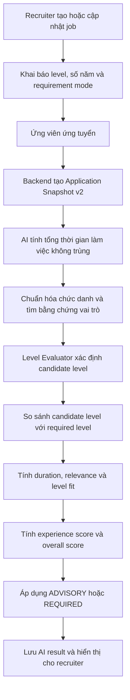

# Kế hoạch triển khai đánh giá level kinh nghiệm ứng viên

> Phiên bản: 1.1  
> Ngày: 2026-08-16  
> Phạm vi: `backend` + `ai-service` + `frontend` + Prisma/Supabase  
> Trạng thái: Đã triển khai phần core; migration đã áp dụng lên Supabase

## Cập nhật triển khai ngày 2026-08-16

Đã hoàn thành:

- schema, migration và default `ADVISORY` cho job hiện có;
- application snapshot v2 và khả năng dispatch snapshot v1;
- deterministic experience-level evaluator `experience-level-v1`;
- công thức experience score v2, recommendation advisory/required;
- persistence, validation và structured audit log ở backend;
- cấu hình job và card giải thích level ở recruiter UI;
- unit/regression test backend, AI test mục tiêu và production build frontend.

Đã deploy migration `20260816090000_add_experience_level_evaluation` lên
Supabase. Việc deploy phiên bản code mới của backend, AI service và frontend,
chạy RabbitMQ end-to-end trên môi trường deployed, shadow monitoring và metrics
dashboard vẫn là bước vận hành tiếp theo.

---

## 1. Mục tiêu

Triển khai khả năng đánh giá ứng viên có đáp ứng level kinh nghiệm của job hay
không, dựa trên dữ liệu có bằng chứng và rule xác định.

Hệ thống cần:

1. Đánh giá được level ứng viên từ `INTERN` đến `DIRECTOR`.
2. So sánh level ứng viên với `experienceLevel` của job.
3. Đưa mức độ phù hợp level vào `experienceScore`.
4. Trả về bằng chứng và độ tin cậy để recruiter kiểm tra.
5. Hỗ trợ hai chế độ `ADVISORY` và `REQUIRED`.
6. Không tự động thay đổi quyết định HR.
7. Giữ nguyên kết quả của application cũ sử dụng snapshot version 1.
8. Cho kết quả giống nhau khi chấm lại cùng một application snapshot.

---

## 2. Hiện trạng

### 2.1 Những phần đang hoạt động

- Job đã có `experienceLevel` và `requiredExperienceYears`.
- Application tạo một snapshot bất biến trước khi gửi sang AI service.
- AI service tính tổng số năm kinh nghiệm sau khi hợp nhất khoảng thời gian bị
  trùng.
- Điểm kinh nghiệm hiện xét:
  - tỷ lệ đáp ứng số năm;
  - độ liên quan giữa chức danh ứng viên và tên job;
  - độ tương đồng giữa mô tả kinh nghiệm và JD;
  - độ liên quan của dự án.
- Cùng một evaluation payload cho kết quả scoring xác định.

### 2.2 Những phần chưa hoạt động

- `experienceLevel` của job chưa được đưa vào application snapshot.
- Không có `candidateExperienceLevel`.
- Không có bảng thứ tự `INTERN < FRESHER < ... < DIRECTOR` trong engine.
- Không có `levelFitScore`, `levelGap`, `levelEligible` hoặc bằng chứng level.
- Không có chế độ advisory/hard requirement cho level.
- Không có UI hiển thị chênh lệch level.
- `autoRejectThreshold`, `autoShortlistThreshold` và
  `rejectOnMissingMandatory` chưa tham gia vào quyết định level.

### 2.3 File hiện tại liên quan

- `backend/prisma/schema.prisma`
- `backend/src/modules/jobs/dto/create-job.dto.ts`
- `backend/src/modules/jobs/jobs.service.ts`
- `backend/src/modules/applications/applications.service.ts`
- `backend/src/modules/applications/application-evaluation.snapshot.ts`
- `backend/src/modules/applications/applications.consumer.ts`
- `backend/src/modules/applications/dto/ai-result.dto.ts`
- `ai-service/app/schemas/matching.py`
- `ai-service/app/services/matching/generic_matcher.py`
- `ai-service/app/services/matching/score_engine.py`
- `frontend/src/components/recruiter/CreateJobWizard.tsx`
- `frontend/src/components/recruiter/JobDetailView.tsx`

---

## 3. Phạm vi và nguyên tắc

### 3.1 Trong phạm vi

- Cấu hình level requirement trên job.
- Đánh giá level ứng viên bằng rule cố định.
- Tích hợp điểm level vào điểm kinh nghiệm.
- Lưu và hiển thị kết quả level.
- Version hóa application snapshot.
- Test, logging, rollout và backward compatibility.

### 3.2 Ngoài phạm vi

- Sửa độ ổn định của quá trình parse CV bằng Gemini.
- Tự động reject hoặc shortlist ứng viên ở cấp HR decision.
- Học level bằng mô hình machine learning.
- Thay đổi taxonomy skill.
- Chấm lại toàn bộ application cũ.

### 3.3 Nguyên tắc bắt buộc

1. Không dùng tuổi, giới tính, ngày sinh hoặc dữ liệu nhạy cảm để suy ra level.
2. Không để LLM tự kết luận level cuối cùng.
3. Level phải được tạo bởi rule có thể kiểm thử và giải thích.
4. `LEAD`, `MANAGER`, `DIRECTOR` phải có bằng chứng vai trò; số năm đơn thuần
   không đủ.
5. Overqualified không bị trừ điểm mặc định.
6. Thiếu dữ liệu không đồng nghĩa với không đủ level.
7. Chế độ mặc định là `ADVISORY`.
8. Engine không tự ghi `hrDecision = REJECTED`.

---

## 4. Luồng xử lý mục tiêu



---

## 5. Mô hình dữ liệu

### 5.1 Enum mới

Thêm vào Prisma:

```prisma
enum LevelRequirementMode {
  ADVISORY
  REQUIRED
}
```

### 5.2 JobPosting

Thêm trường:

```prisma
model JobPosting {
  // Existing fields
  experienceLevel         ExperienceLevel     @default(JUNIOR)
  requiredExperienceYears Int?

  // New field
  levelRequirementMode LevelRequirementMode @default(ADVISORY)
}
```

Không thêm một cờ `rejectOnInsufficientLevel` riêng để tránh có hai nguồn cấu
hình mang cùng ý nghĩa.

### 5.3 AiMatchingResult

Thêm các trường phục vụ truy vấn và UI:

```prisma
model AiMatchingResult {
  // Existing fields

  candidateExperienceLevel ExperienceLevel? @map("candidate_experience_level")
  requiredExperienceLevel  ExperienceLevel? @map("required_experience_level")
  totalExperienceYears     Decimal?          @map("total_experience_years") @db.Decimal(5, 2)
  levelFitScore            Decimal?          @map("level_fit_score") @db.Decimal(5, 2)
  levelGap                 Int?              @map("level_gap")
  levelEligible            Boolean?          @map("level_eligible")
  levelConfidence          Decimal?          @map("level_confidence") @db.Decimal(3, 2)
  levelEvidence            Json?             @map("level_evidence")
}
```

Lý do không chỉ lưu một JSON tổng hợp:

- recruiter cần filter theo level và eligibility;
- dashboard cần aggregate;
- trường bằng chứng linh hoạt vẫn được giữ dưới dạng JSON.

### 5.4 Migration Supabase

Quy trình:

1. Cập nhật `schema.prisma`.
2. Tạo Prisma migration có tên gợi ý:
   `add_experience_level_evaluation`.
3. Kiểm tra SQL migration không thay đổi dữ liệu hiện tại.
4. Deploy migration trước backend mới.
5. Xác minh default của job cũ là `ADVISORY`.

Migration không chấm lại hoặc sửa `ai_matching_results` hiện có.

---

## 6. Hợp đồng API và snapshot

### 6.1 Create/Update Job DTO

Thêm:

```typescript
levelRequirementMode?: 'ADVISORY' | 'REQUIRED';
```

Validation:

- chỉ nhận hai giá trị enum;
- mặc định `ADVISORY`;
- `requiredExperienceYears >= 0`;
- `experienceLevel` vẫn bắt buộc theo contract hiện tại;
- cảnh báo nhưng không chặn các tổ hợp bất thường, ví dụ `INTERN` và 5 năm.

### 6.2 Application Snapshot v2

Tăng:

```typescript
APPLICATION_SNAPSHOT_VERSION = 2;
```

Job payload trong snapshot phải có:

```json
{
  "experience_level": "MIDDLE",
  "required_experience_years": 3,
  "level_requirement_mode": "ADVISORY"
}
```

Candidate payload tiếp tục dùng danh sách `work_experiences` và `projects` đã
được đóng băng tại thời điểm apply.

### 6.3 Backward compatibility

- Snapshot version 1 tiếp tục được đánh giá bằng công thức cũ.
- Snapshot version 2 sử dụng level evaluator mới.
- Retry của application phải luôn sử dụng snapshot ban đầu.
- Không tự nâng snapshot version của application đã tồn tại.

Khuyến nghị tách builder:

```text
createEvaluationMessageV1(snapshot)
createEvaluationMessageV2(snapshot)
```

Không nên cho code v2 âm thầm đoán dữ liệu còn thiếu trong snapshot v1.

### 6.4 AI result contract

Mở rộng response:

```json
{
  "overall_score": 81.4,
  "experience_score": 80.5,
  "experience_assessment": {
    "candidate_level": "JUNIOR",
    "required_level": "MIDDLE",
    "total_experience_years": 2.4,
    "duration_score": 80,
    "relevance_score": 90,
    "level_fit_score": 70,
    "level_gap": 1,
    "level_eligible": false,
    "level_confidence": 0.9,
    "level_requirement_mode": "ADVISORY",
    "evidence": [
      "2.4 năm kinh nghiệm không trùng thời gian",
      "Chức danh gần nhất: Junior Flutter Developer"
    ]
  }
}
```

---

## 7. Thuật toán đánh giá level

### 7.1 Bảng rank

```python
LEVEL_RANK = {
    "INTERN": 0,
    "FRESHER": 1,
    "JUNIOR": 2,
    "MIDDLE": 3,
    "SENIOR": 4,
    "LEAD": 5,
    "MANAGER": 6,
    "DIRECTOR": 7,
}
```

Đây là rank phục vụ so sánh requirement, không khẳng định `LEAD` và `MANAGER`
là cùng một career track trong mọi doanh nghiệp. Nếu tương lai cần tách track,
phải version hóa thuật toán.

### 7.2 Khoảng năm tham khảo

| Level | Kinh nghiệm tham khảo | Điều kiện bổ sung |
|---|---:|---|
| INTERN | Chưa có hoặc chỉ thực tập | Có title/evidence thực tập |
| FRESHER | Dưới 1 năm | Không có vai trò full-time rõ ràng |
| JUNIOR | 1–2 năm | Không yêu cầu leadership |
| MIDDLE | 2–4 năm | Có kinh nghiệm thực hiện độc lập |
| SENIOR | 4–7 năm | Có title hoặc bằng chứng trách nhiệm cao |
| LEAD | Từ 6 năm | Bắt buộc có leadership evidence |
| MANAGER | Không suy ra chỉ từ số năm | Bắt buộc có management evidence |
| DIRECTOR | Không suy ra chỉ từ số năm | Bắt buộc có director-level evidence |

Các ngưỡng phải được đặt trong một module cấu hình duy nhất, không rải rác trong
code.

### 7.3 Chuẩn hóa title

Tạo bộ từ khóa ban đầu:

```python
TITLE_SIGNALS = {
    "INTERN": ["intern", "internship", "thực tập", "thực tập sinh"],
    "FRESHER": ["fresher", "graduate", "new graduate", "mới tốt nghiệp"],
    "JUNIOR": ["junior", "jr", "entry level"],
    "MIDDLE": ["middle", "mid-level", "intermediate"],
    "SENIOR": ["senior", "sr", "principal", "staff"],
    "LEAD": ["team lead", "tech lead", "technical lead", "trưởng nhóm"],
    "MANAGER": ["manager", "engineering manager", "quản lý"],
    "DIRECTOR": ["director", "head of", "giám đốc", "trưởng phòng"],
}
```

Không match substring thiếu kiểm soát. Ví dụ `sr` chỉ được match theo token để
tránh collision.

### 7.4 Bằng chứng leadership/management

Các evidence signal tham khảo:

- quản lý hoặc dẫn dắt một nhóm;
- phân công và review công việc;
- mentoring/coaching;
- chịu trách nhiệm delivery hoặc roadmap;
- tuyển dụng hoặc đánh giá hiệu suất;
- quản lý ngân sách, headcount hoặc nhiều team.

Trong phiên bản đầu, dùng rule keyword/token trên nội dung snapshot. Không gọi
LLM bổ sung trong bước scoring.

### 7.5 Cách chọn candidate level

Thứ tự:

1. Tính tổng thời gian làm việc hợp lệ và không trùng.
2. Lấy title signal mạnh nhất, ưu tiên công việc gần nhất.
3. Tính baseline level từ số năm.
4. Kết hợp baseline và title:
   - title thấp hơn baseline một bậc: chọn mức thấp hơn và giảm confidence;
   - title cao hơn baseline một bậc: chỉ nâng nếu duration của role hợp lý;
   - chênh từ hai bậc: chọn mức thận trọng hơn và giảm confidence.
5. Với `LEAD/MANAGER/DIRECTOR`, kiểm tra evidence gate.
6. Nếu không đủ evidence, cap ở `SENIOR`.
7. Trả về danh sách evidence và reason code.

Reason code đề xuất:

```text
YEARS_BASELINE
RECENT_TITLE_SIGNAL
LEADERSHIP_EVIDENCE
MANAGEMENT_EVIDENCE
INSUFFICIENT_MANAGEMENT_EVIDENCE
TITLE_YEARS_CONFLICT
INSUFFICIENT_DATA
```

### 7.6 Confidence

Tính deterministic:

| Dữ liệu | Confidence |
|---|---:|
| Có ngày hợp lệ + title rõ ràng + không xung đột | 0.90–1.00 |
| Có ngày và title nhưng xung đột một bậc | 0.70–0.89 |
| Chỉ có số năm hoặc chỉ có title | 0.50–0.69 |
| Thiếu ngày và title không rõ | dưới 0.50 |

Nếu `levelConfidence < 0.5`:

- `levelEligible` phải là `null`, không phải `false`;
- UI hiển thị “Không đủ dữ liệu xác định level”;
- chế độ `REQUIRED` không được tự đánh dấu không đủ điều kiện.

### 7.7 Level fit score

```python
gap = required_rank - candidate_rank

if gap <= 0:
    level_fit_score = 100
elif gap == 1:
    level_fit_score = 70
elif gap == 2:
    level_fit_score = 35
else:
    level_fit_score = 0
```

Eligibility:

```python
if confidence < 0.5:
    level_eligible = None
else:
    level_eligible = gap <= 0
```

---

## 8. Công thức điểm

### 8.1 Experience score v2

```text
Experience Score =
    Duration Score  × 35%
  + Relevance Score × 35%
  + Level Fit Score × 30%
```

Trong đó:

- `Duration Score`: mức đáp ứng `requiredExperienceYears`.
- `Relevance Score`: title similarity + description similarity + project
  relevance theo engine hiện tại.
- `Level Fit Score`: mục 7.7.

Nếu không đủ dữ liệu level (`confidence < 0.5`):

```text
Experience Score =
    Duration Score  × 50%
  + Relevance Score × 50%
```

Không dùng điểm level trung lập 50 trong công thức vì sẽ trừ điểm ứng viên chỉ
do dữ liệu thiếu.

### 8.2 Overall score

Công thức tổng không đổi:

```text
Overall Score =
    Skills Score    × Skill Weight
  + Experience Score × Experience Weight
  + Education Score  × Education Weight
  + Other Score      × Other Weight
```

Chuẩn hóa theo tổng trọng số nếu tổng khác 100.

### 8.3 Chế độ ADVISORY

- Level fit ảnh hưởng `experienceScore`.
- Trả `levelEligible`, warning và evidence.
- Không thay đổi application stage hoặc HR decision.

### 8.4 Chế độ REQUIRED

- Vẫn tính và lưu toàn bộ score để recruiter có dữ liệu tham khảo.
- Nếu `levelEligible = false`, trả recommendation `NOT_ELIGIBLE_LEVEL`.
- Nếu `levelEligible = null`, trả recommendation `NEEDS_REVIEW`.
- Không tự động reject trong phiên bản đầu.

---

## 9. Thiết kế module AI service

### 9.1 Module mới

Tạo:

```text
ai-service/app/services/matching/experience_level_evaluator.py
```

Interface đề xuất:

```python
class ExperienceLevelAssessment(BaseModel):
    candidate_level: Optional[ExperienceLevel]
    required_level: ExperienceLevel
    total_experience_years: float
    level_fit_score: Optional[float]
    level_gap: Optional[int]
    level_eligible: Optional[bool]
    confidence: float
    evidence: list[str]
    reason_codes: list[str]


class ExperienceLevelEvaluator:
    def evaluate(
        self,
        work_experiences: list[WorkExperience],
        required_level: ExperienceLevel,
    ) -> ExperienceLevelAssessment:
        ...
```

### 9.2 Trách nhiệm module

- Không gọi database.
- Không gọi embedding hoặc LLM.
- Không phụ thuộc RabbitMQ.
- Input/Output typed bằng Pydantic.
- Kết quả hoàn toàn deterministic.
- Không sửa trực tiếp `candidate_profile` hoặc `job`.

### 9.3 Tích hợp generic matcher

`generic_matcher.py` trả thêm:

```python
{
    "experience": {
        "score": 0.805,
        "duration_score": 0.8,
        "relevance_score": 0.9,
        "level_fit_score": 0.7,
        "level_assessment": {...}
    }
}
```

`score_engine.py` chỉ scale về 0–100 và áp dụng trọng số tổng. Không đặt rule
level ở cả `generic_matcher.py` và `score_engine.py` để tránh nhân đôi logic.

---

## 10. Backend implementation

### 10.1 Job module

Thay đổi:

- DTO nhận `levelRequirementMode`.
- Create/update service persist trường mới.
- Job detail trả về trường mới.
- Candidate job public response có thể trả level và số năm, nhưng không trả cấu
  hình scoring nội bộ không cần thiết.

### 10.2 Application snapshot

- Tăng schema version.
- Thêm ba trường level của job.
- Viết validator cho snapshot v2.
- Unit test để bảo đảm snapshot lưu đúng giá trị tại thời điểm apply.

### 10.3 Consumer

Mở rộng `AiResultSchema` để validate `experience_assessment`.

Persist trong cùng transaction đang lưu `aiMatchingResult`:

- candidate level;
- required level;
- total years;
- fit score;
- gap;
- eligible;
- confidence;
- evidence.

Nếu payload level không hợp lệ:

- không lưu một phần result;
- đánh dấu evaluation retry theo cơ chế hiện tại;
- log reason nhưng không log PII hoặc toàn bộ CV.

---

## 11. Frontend implementation

### 11.1 Create Job Wizard

Thêm field:

- Level yêu cầu.
- Số năm kinh nghiệm.
- Chế độ kiểm tra level.

Copy đề xuất:

```text
Chỉ cảnh báo (khuyên dùng)
Ứng viên thiếu level vẫn được chấm và hiển thị để recruiter quyết định.

Điều kiện bắt buộc
Hệ thống đánh dấu ứng viên không đủ điều kiện nếu level thấp hơn yêu cầu.
```

Validation UX:

- `requiredExperienceYears` không âm;
- cảnh báo khi level và số năm mâu thuẫn;
- cảnh báo không chặn submit;
- mặc định `ADVISORY`.

### 11.2 Candidate/Application Detail

Hiển thị một card:

```text
Đánh giá level
Ứng viên: Junior
Yêu cầu: Middle
Mức phù hợp: 70/100
Kinh nghiệm: 2.4/3 năm
Kết luận: Thấp hơn 1 level
Độ tin cậy: 90%
```

Trạng thái UI:

- xanh: đủ hoặc vượt level;
- vàng: thiếu một level hoặc advisory warning;
- đỏ: không đủ trong chế độ required;
- xám: không đủ dữ liệu.

Không dùng màu làm tín hiệu duy nhất; luôn có text và icon.

### 11.3 Evidence disclosure

Evidence hiển thị dạng có thể mở rộng:

```text
- 2.4 năm kinh nghiệm không trùng thời gian
- Chức danh gần nhất: Junior Flutter Developer
- Không tìm thấy bằng chứng dẫn dắt đội nhóm
```

Không hiển thị suy luận như một dữ kiện tuyệt đối. Dùng nhãn “Hệ thống đánh
giá” thay vì “Level chính thức”.

---

## 12. Kế hoạch kiểm thử

### 12.1 Unit test AI service

Các case bắt buộc:

1. Không có experience → `candidateLevel = null`, confidence thấp.
2. Internship rõ ràng → `INTERN`.
3. 0.8 năm full-time → `FRESHER`.
4. 1.5 năm + Junior title → `JUNIOR`.
5. 3 năm + title Middle → `MIDDLE`.
6. 5 năm + Senior title → `SENIOR`.
7. 8 năm không leadership evidence → không tự lên `LEAD`.
8. 7 năm + Tech Lead + leadership evidence → `LEAD`.
9. Manager title không management evidence → cap và giảm confidence.
10. Khoảng thời gian công việc trùng không bị cộng hai lần.
11. Job Middle, candidate Junior → gap 1, fit 70.
12. Candidate Senior, job Junior → fit 100, không bị phạt.
13. Title và số năm xung đột → conservative result + reason code.
14. Reorder work experience không làm thay đổi tổng số năm.
15. Chấm cùng payload 10 lần cho kết quả giống nhau.

### 12.2 Unit test backend

- DTO validation cho enum mới.
- Create/update job persist đúng mode.
- Snapshot v2 chứa level config.
- Snapshot v1 vẫn được dispatch đúng.
- Consumer persist đủ experience assessment.
- Invalid assessment không tạo partial result.

### 12.3 Integration test

```text
Create job → Apply → Snapshot v2 → RabbitMQ request
→ AI result → Backend consumer → Supabase result
```

Assert:

- required level nhất quán từ job đến AI result;
- total years không thay đổi qua serialization;
- level fit được đưa vào experience score;
- retry không tạo kết quả khác với cùng snapshot;
- mode `ADVISORY` và `REQUIRED` trả recommendation khác nhau;
- HR decision không bị thay đổi tự động.

### 12.4 Frontend test

- Form mặc định advisory.
- Validation số năm.
- Edit job giữ nguyên mode.
- Card hiển thị đủ bốn trạng thái.
- Missing assessment không làm trang lỗi.
- Snapshot v1 hiển thị “Chưa có đánh giá level”.

---

## 13. Observability

Log structured, không chứa PII:

```json
{
  "event": "experience_level_evaluated",
  "application_id": "...",
  "candidate_level": "JUNIOR",
  "required_level": "MIDDLE",
  "level_gap": 1,
  "eligible": false,
  "confidence": 0.9,
  "algorithm_version": "experience-level-v1"
}
```

Metrics đề xuất:

- tỷ lệ application có level xác định được;
- phân bố confidence;
- phân bố level gap;
- tỷ lệ `NOT_ELIGIBLE_LEVEL` theo job;
- tỷ lệ recruiter vẫn shortlist ứng viên bị cảnh báo;
- số lỗi validation assessment;
- độ trễ evaluation trước và sau triển khai.

Lưu `algorithm_version` trong result hoặc `modelVersion` để audit.

---

## 14. Kế hoạch rollout

### Pha 0 — Baseline

- Chạy toàn bộ backend và AI tests hiện tại.
- Lưu fixture của một số application snapshot v1.
- Ghi lại score hiện tại để phát hiện regression ngoài ý muốn.

### Pha 1 — Schema và contract

- Thêm enum/column Prisma.
- Tạo migration.
- Cập nhật DTO và API type.
- Deploy migration trước, code cũ vẫn hoạt động.

### Pha 2 — Snapshot v2

- Thêm job level fields vào snapshot.
- Hỗ trợ song song snapshot v1/v2.
- Chưa thay đổi score ở pha này.

### Pha 3 — Level evaluator

- Tạo module rule engine.
- Viết đầy đủ unit test.
- Tích hợp vào generic matcher dưới feature flag.

Feature flag đề xuất:

```text
EXPERIENCE_LEVEL_SCORING_ENABLED=false
```

### Pha 4 — Persistence

- Mở rộng result schema.
- Persist assessment trong backend consumer.
- Kiểm tra integration qua RabbitMQ.

### Pha 5 — Frontend

- Thêm cấu hình job.
- Thêm card kết quả level.
- Ẩn/disable mode `REQUIRED` nếu feature flag chưa bật hoàn toàn.

### Pha 6 — Shadow mode

- Bật evaluator nhưng chưa thay đổi `experienceScore`.
- Lưu assessment để so sánh với đánh giá thủ công của recruiter.
- Chạy shadow mode tối thiểu trên một tập application test đại diện.

### Pha 7 — Advisory mode

- Bật level fit trong experience score.
- Tất cả job mặc định advisory.
- Theo dõi distribution score và recruiter feedback.

### Pha 8 — Required mode

- Chỉ mở khi advisory ổn định.
- Recruiter phải chủ động chọn required.
- Chỉ trả recommendation, chưa tự động reject.

---

## 15. Thứ tự công việc chi tiết

```text
T1  Chốt rule level, ngưỡng năm và title dictionary
T2  Thêm LevelRequirementMode và result columns vào Prisma
T3  Tạo/chạy migration trên môi trường test
T4  Cập nhật create/update job DTO và service
T5  Tăng snapshot version lên v2 và thêm compatibility router
T6  Cập nhật matching Pydantic schemas
T7  Tạo experience_level_evaluator.py
T8  Viết unit test cho level evaluator
T9  Refactor experience matching thành duration/relevance/level components
T10 Tích hợp công thức experience score v2 dưới feature flag
T11 Mở rộng AI response schema
T12 Cập nhật backend consumer và persistence
T13 Viết integration test RabbitMQ end-to-end
T14 Thêm level requirement vào Create Job Wizard
T15 Thêm assessment card vào application detail
T16 Chạy regression test backend, AI service và frontend build
T17 Deploy migration → backend → AI service → frontend
T18 Chạy shadow mode và kiểm tra metrics
T19 Bật advisory mode
T20 Đánh giá trước khi mở required mode
```

---

## 16. Rủi ro và biện pháp giảm thiểu

| Rủi ro | Ảnh hưởng | Giảm thiểu |
|---|---|---|
| Parse CV thiếu experience/title | Không xác định đúng level | Confidence + trạng thái unknown; không hard fail |
| Job khai báo level và số năm mâu thuẫn | Kết quả khó hiểu | Warning trong wizard; hiển thị cả hai tiêu chí |
| Title không chuẩn | Suy luận sai level | Dictionary có version; token matching; evidence rõ ràng |
| Số năm cao bị hiểu là manager | False positive | Evidence gate cho Lead/Manager/Director |
| Score application cũ thay đổi | Mất tính audit | Snapshot v1 dùng engine cũ |
| Required mode loại nhầm | Ảnh hưởng tuyển dụng | Rollout advisory trước; không tự động reject |
| Chênh career track Lead/Manager | So sánh rank quá đơn giản | Ghi rõ limitation; version 2 có thể tách track |
| Logic rải ở nhiều nơi | Khó bảo trì | Một evaluator và một config module duy nhất |

---

## 17. Tiêu chí nghiệm thu

Tính năng chỉ được coi là hoàn thành khi:

- [x] Job lưu và trả đúng `levelRequirementMode`.
- [x] Application mới sử dụng snapshot version 2.
- [x] Snapshot v1 tiếp tục hoạt động.
- [x] Candidate level được tạo bởi deterministic rule engine.
- [x] Tổng số năm xử lý đúng khoảng thời gian trùng.
- [x] Lead/Manager/Director không được suy ra chỉ từ số năm.
- [x] Result có level, gap, fit score, eligible, confidence và evidence.
- [x] Experience score sử dụng công thức 35/35/30 khi đủ dữ liệu.
- [x] Thiếu dữ liệu level không làm ứng viên bị phạt.
- [x] Advisory không thay đổi HR decision.
- [x] Required chỉ trả recommendation, không tự động reject.
- [x] Recruiter UI hiển thị rõ level ứng viên và level yêu cầu.
- [x] Cùng snapshot được chấm lại cho kết quả giống nhau.
- [ ] Backend tests, AI tests, frontend lint và build đều pass. Backend, AI test
  mục tiêu và frontend build đã pass; frontend còn lỗi lint tồn tại từ trước.
- [x] Migration đã được kiểm tra rollback hoặc phương án roll-forward.
- [ ] Có log `algorithm_version` và metrics cơ bản. Structured log đã có; metrics
  dashboard chưa triển khai.

---

## 18. Definition of Done

```text
Schema migrated
+ API contract versioned
+ Snapshot v1/v2 compatible
+ Deterministic level evaluator
+ Experience scoring v2
+ Result persistence
+ Recruiter UI
+ Automated tests
+ Shadow mode verification
+ Advisory rollout
= Done
```

Chế độ `REQUIRED` là bước rollout sau, không phải điều kiện để bật advisory cho
người dùng.
