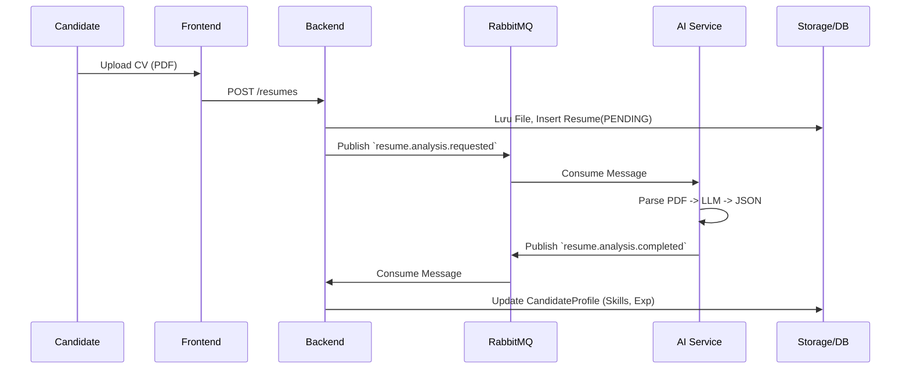
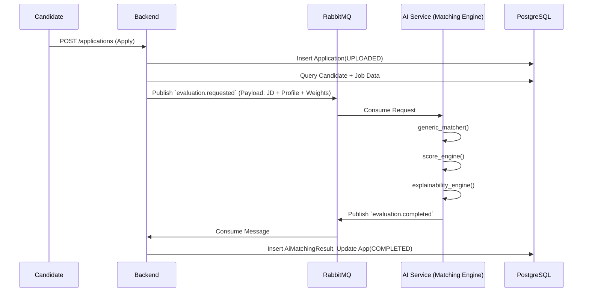
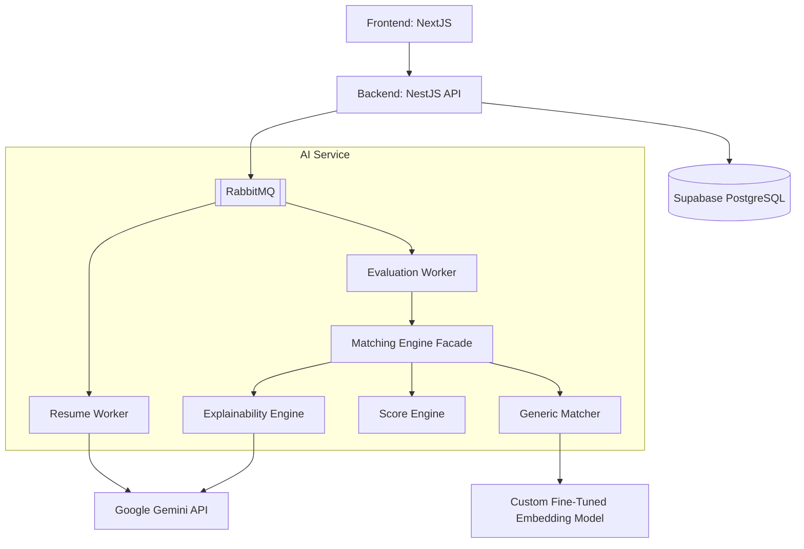

# ENTERPRISE ARCHITECTURE & EXECUTION FLOW REPORT
**Dự án**: AI Recruitment Platform
**Vai trò phân tích**: Principal Software Architect / System Analyst

Tài liệu này là kết quả của quá trình Reverse Engineering toàn bộ dự án hiện tại, mô tả chi tiết từ cấu trúc thư mục, luồng hệ thống, cho đến kiến trúc AI Pipeline bên dưới.

---

## PHẦN 1: PROJECT STRUCTURE (CẤU TRÚC DỰ ÁN)

Hệ thống được chia thành 3 service chính tương tác qua HTTP và Message Broker (RabbitMQ), sử dụng chung một Database (Supabase PostgreSQL):

### 1. Backend (`/backend`)
Đóng vai trò là Core API Gateway và Business Logic Handler. Viết bằng **NestJS**.
- **`src/modules/applications`**: Xử lý logic Ứng viên nộp đơn. Chứa `applications.service.ts` (Publisher) và `applications.consumer.ts` (Consumer) giao tiếp với AI Service.
- **`src/modules/resumes`**: Xử lý logic CV. Có chức năng Hydration (Đọc PDF ra Data) thông qua AI.
- **`src/modules/candidates` & `jobs` & `recruiters`**: CRUD chuẩn cho các thực thể.
- **`src/infrastructure/rabbitmq`**: Module bọc AMQP để publish/subscribe events.
- **`src/database/prisma.service.ts`**: ORM kết nối PostgreSQL.

### 2. AI Service (`/ai-service`)
Đóng vai trò là Worker xử lý các tác vụ nặng về AI, NLP và Matching. Viết bằng **Python (FastAPI + Pika)**.
- **`app/workers/`**: Chứa `resume_worker.py` (chờ parse CV) và `evaluation_worker.py` (chờ chấm điểm Matching).
- **`app/services/matching/`**: Trái tim của hệ thống chấm điểm. Chứa kiến trúc Pipeline (`generic_matcher.py` -> `score_engine.py` -> `explainability_engine.py`).
- **`app/adapters/gemini_llm.py`**: Dependency để gọi Google Gemini API thực hiện trích xuất và semantic search.

### 3. Frontend (`/frontend`)
Giao diện người dùng viết bằng **Next.js (App Router)**.
- **`src/app/candidate/`**: Không gian của ứng viên (Upload CV, Tìm việc, Nộp đơn).
- **`src/app/recruiter/`**: Không gian của HR (Tạo JD, Cấu hình trọng số AI, Xem điểm ứng viên).

---

## PHẦN 2: SYSTEM WORKFLOW (LUỒNG HOẠT ĐỘNG CHÍNH)

Luồng đi từ lúc Ứng viên tham gia đến khi HR xem kết quả AI:

1. **Đăng ký & Cập nhật Profile (Candidate)**
   - Candidate đăng nhập (Supabase Auth).
   - Tải file PDF CV lên. Frontend gọi API Backend.
   - Backend upload PDF lên Supabase Storage lấy link, tạo record `Resume` trạng thái `PENDING`.
   - Backend ném event `RESUME_ANALYSIS_REQUESTED` vào RabbitMQ.
   - AI Service nhận event, đọc PDF, dùng LLM parse ra JSON. Trả event `COMPLETED`.
   - Backend nghe event, bóc tách JSON lưu thành `CandidateProfile` (Work Experience, Education, Skills).

2. **Tạo Job (Recruiter)**
   - HR vào giao diện tạo Job, điền mô tả, chọn yêu cầu (Skills, Kinh nghiệm, Bằng cấp).
   - HR **tự cấu hình trọng số AI** (ví dụ: Kỹ năng 40%, Kinh nghiệm 30%, Học vấn 15%, Chứng chỉ 15%).
   - Backend lưu Job vào Database.

3. **Nộp đơn (Application)**
   - Ứng viên bấm Apply Job.
   - Backend tạo record `Application` (trạng thái `UPLOADED`).
   - Backend tổng hợp Data (JD + Candidate Profile + Trọng số) ném event `EVALUATION_REQUESTED` vào RabbitMQ.

4. **Chấm điểm (AI Matching)**
   - AI Service nhận Data, chạy qua 3-tier Pipeline (Generic Matcher -> Score -> Explainability).
   - Trả về điểm số chi tiết và nhận xét. Ném event `EVALUATION_COMPLETED` lại RabbitMQ.

5. **Hiển thị kết quả (Frontend)**
   - Backend lưu AI Result vào bảng `AiMatchingResult`.
   - HR mở Job Detail, thấy danh sách ứng viên đã được xếp hạng từ cao xuống thấp kèm giải thích vì sao phù hợp/không phù hợp.

---

## PHẦN 3: SEQUENCE DIAGRAM

### 1. Candidate Upload CV (Resume Parsing)

### 2. Candidate Apply Job & AI Matching

---

## PHẦN 4: AI PIPELINE (MATCHING)

Trace chi tiết luồng AI khi nhận request `evaluation.requested`:

1. **`app/workers/evaluation_worker.py`**: Consume RabbitMQ, deserialize JSON -> Pydantic `EvaluationRequest`.
2. **`app/services/matching/matching_engine.py` (Facade)**: Khởi tạo luồng.
3. **`generic_matcher.py`**:
   - `_match_skills()`: Duyệt qua `job.required_skills`. Phân loại Mandatory/Nice-to-have. Gọi LLM/Semantic để so sánh skill của candidate có đáp ứng không.
   - `_match_experience()`: Cộng dồn số tháng kinh nghiệm của Candidate, so sánh với `job.required_experience_years`.
   - `_match_education()`: So sánh `degree_level` (Bachelor, Master) và `major`.
   - `_match_certificates()`: So khớp chứng chỉ của ứng viên với yêu cầu công việc.
4. **`score_engine.py`**: Lấy raw scores (0-1) nhân với **Weights** mà HR cấu hình (nằm trong request). Tính ra `overall_score`. Map thành Label (EXCELLENT, GOOD, FAIR).
5. **`explainability_engine.py`**: Gửi LLM (Gemini) điểm số và raw metrics để sinh ra đoạn text `Summary` (Nhận xét tổng quan), `Strengths` (Điểm mạnh), `Gaps` (Điểm yếu). Đảm bảo tính minh bạch (Explainable AI).
6. **Worker Return**: Gửi lại message lên RabbitMQ.

---

## PHẦN 5: DATA FLOW

**Bước 1: Resume -> Structured Data**
- `Input`: File PDF (mock/abc.pdf).
- `Processing`: OCR/PyMuPDF -> LLM Prompt -> Structured Schema.
- `Output`: JSON (work_experiences, educations, skills).

**Bước 2: Evaluation -> AI Result**
- `Input`: JSON lớn chứa toàn bộ Data Ứng viên (thâm niên, kỹ năng) và JD (Yêu cầu thâm niên, kỹ năng bắt buộc).
- `Processing`: 
  - Kỹ năng A (JD) vs Kỹ năng B (CV) -> Dùng Semantic Similarity -> Ra % match.
  - Kinh nghiệm -> Tính toán thời gian (start_date - end_date).
- `Output`: JSON chứa `overall_score`, `skills_score`, `strengths`, `gaps`.

---

## PHẦN 6: MATCHING FLOW & RESPONSIBILITY

- **Skills Matching**: Kết hợp *Rule Engine* (chấm Mandatory skills riêng) và *LLM/Embedding* (so sánh ngữ nghĩa nếu tên skill không khớp chính xác 100%). Python xử lý logic vòng lặp, phần **Semantic Matching** sử dụng một Custom Embedding Model (Fine-tuned Bi-Encoder) để tính toán độ tương đồng một cách cực kỳ chính xác và nhanh chóng (thay vì phụ thuộc vào Gemini cho việc này).
- **Experience Matching**: Tính toán tổng thời gian (Duration) bằng *Rule-based* (đảm bảo không sai lệch ngày tháng). Tuy nhiên, **Độ liên quan (Relevance)** của kinh nghiệm được chấm bằng *Semantic Model*. Đặc biệt, **với Sinh viên (Intern/Fresher)** chưa đi làm, hệ thống tự động kích hoạt cơ chế Fallback: Lấy 100% điểm **Dự án thực tế (Projects)** để thay thế cho điểm kinh nghiệm, đảm bảo tính công bằng cao.
- **Education/Certificates**: *Rule-based* kết hợp *Semantic Model*. Đánh giá độ khớp của Chuyên ngành (Major) với yêu cầu công việc. *(Lưu ý: Hệ thống hiện tại chưa thu thập và chấm điểm dựa trên điểm số GPA).*
- **Explainability**: *LLM-based* 100%. Đọc kết quả của Rule Engine để sinh text tiếng người. Đảm bảo bot không "tự bịa" ra điểm.

---

## PHẦN 7: SCORING FLOW

Điểm số được sinh ra theo công thức ở `score_engine.py`:
1. `raw_skill_score = (mandatory_matched / total_mandatory) * 0.7 + (optional_matched / total_optional) * 0.3`
2. `raw_exp_score = min(1.0, candidate_months / (required_years * 12))`
3. Tương tự cho Education và Certificates.
4. `Overall Score = (raw_skill * weight_skill) + (raw_exp * weight_exp) + (raw_edu * weight_edu) + (raw_cert * weight_cert)`
Điểm xuất phát từ các rules của Python -> Qua `ScoreEngine` -> Gắn vào RabbitMQ -> Lưu xuống bảng `AiMatchingResult` (cột `overall_score`).

---

## PHẦN 8: DEPENDENCY GRAPH

---

## PHẦN 9: ARCHITECTURE REVIEW

- **Điểm mạnh (Strengths)**:
  - Tách bạch hoàn toàn Backend và AI (Microservice-like) bằng Event-driven (RabbitMQ). Không làm đứng Web API khi AI xử lý chậm.
  - Cơ chế tính điểm linh hoạt: Domain-agnostic (dùng chung 4 dimension). Không bị hard-code chuyên ngành IT.
  - Explainable AI: Chia rõ ràng việc "Tính toán" (bằng Code) và "Giải thích" (bằng LLM). Chống ảo giác (Hallucinations).
- **Điểm yếu (Weaknesses) & Tech Debt**:
  - Không có Real-time feedback cho Frontend (WebSocket). Ứng viên nộp CV xong phải F5 để xem trạng thái đổi từ PROCESSING sang COMPLETED.
  - LLM Rate Limit: Việc bóc tách CV (Resume Worker) phụ thuộc quá nhiều vào LLM (Gemini).
- **Extensibility**: Rất tốt. Cấu trúc 3-tier của Matching Engine cho phép thêm Dimension thứ 5, thứ 6 (Personality Test, Interview Score) một cách dễ dàng ở `score_engine.py`.

---

## PHẦN 10: CURRENT BOTTLENECKS (TOP 10 VẤN ĐỀ)

1. **LLM API Latency**: API Gemini phải chờ 3-5 giây cho mỗi tác vụ parse CV hoặc summarize. Nếu có 1000 CV, Worker sẽ bị nghẽn.
2. **RabbitMQ Single Point of Failure**: Nếu RabbitMQ chết, toàn bộ hệ thống bị chia cắt.
3. **Database Polling Frontend**: Frontend hiện tại có thể phải polling hoặc refresh thủ công để lấy dữ liệu AI Result.
4. **Semantic Matching Overhead**: Gọi LLM cho từng Skill chưa khớp chính xác (`semantic.py`) là rất đắt đỏ về thời gian.
5. **Thiếu Dead Letter Handling chi tiết**: CV lỗi vào Dead Letter Queue nhưng chưa có giao diện cho Admin xử lý (Replay).
6. **Resume Date Parsing Fragility**: AI LLM bóc tách `start_date` / `end_date` đôi khi bị sai định dạng chuẩn ISO làm Rule-engine tính thâm niên bị vỡ.
7. **Storage Signed URL Expiry**: Background cronjob có thể dính lỗi nếu File CV trên bucket bị xóa (như lỗi chúng ta vừa debug).
8. **Heavy Prisma Includes**: Câu query join dữ liệu gửi qua AI Matching tải toàn bộ Relations, tiềm ẩn rủi ro hiệu năng khi Database phình to.
9. **Synchronous LLM Calls trong Python**: Các hàm gọi Gemini chưa thực sự tận dụng tối đa `asyncio`.
10. **Thiếu Caching**: Những Job tương tự nhau hoặc các chứng chỉ chuẩn (như TOEIC, IELTS) đang phải xử lý lại từ đầu thay vì lấy từ Cache (Redis).

---

## PHẦN 11: CUSTOM EMBEDDING MODEL (FINE-TUNING PIPELINE)

Hệ thống **không chỉ gọi API thuần túy** mà còn sở hữu một Mô hình AI (Embedding Model) tự train/fine-tune để tăng tốc độ và độ chính xác của Semantic Search:

1. **Dataset Preparation (`DuLieuDataSet/`)**: 
   - Hệ thống có một thư mục chứa script crawl và xử lý data (`prepare_dataset.py`, `linkedin-job-postings-dataset.ipynb`).
   - Dữ liệu được tổng hợp thành `paired_jd_cv.csv` chứa các cặp JD và CV song ngữ.
2. **Training Process (`train_embedding.py`)**:
   - Sử dụng `sentence-transformers` và `MultipleNegativesRankingLoss`.
   - **Base model**: Khởi tạo từ `bkai-foundation-models/vietnamese-bi-encoder` (Mô hình tiếng Việt) hoặc fallback sang `intfloat/multilingual-e5-base`.
   - **Fine-tuning**: Train model dựa trên bộ dữ liệu `paired_jd_cv.csv` để model hiểu sâu về ngữ cảnh tuyển dụng (HR Domain).
   - **Output**: Lưu mô hình vào `ai-service/app/models/fine_tuned_embedder`.
3. **Inference Pipeline (`semantic.py`)**:
   - Class `SemanticMatcher` ưu tiên nạp mô hình đã fine-tune từ local disk.
   - Khi `generic_matcher.py` cần tính độ tương đồng kỹ năng (VD: "React" vs "ReactJS"), nó sẽ dùng mô hình này sinh embedding và tính Cosine Similarity (hoặc Batch Encoding cho toàn bộ list skill cùng lúc).
   - Khắc phục hoàn toàn độ trễ của việc gọi Gemini API cho mỗi phép toán so sánh từ vựng.

---

## PHẦN 12: FUTURE REFACTOR PLAN (ROADMAP ĐỀ XUẤT)

Đây là lộ trình nâng cấp hệ thống (Không thực thi code ngay):

**Phase 1: Performance & Resilience**
- Áp dụng Redis Cache cho Semantic Matcher (Ví dụ: Đã từng hỏi Gemini "React" vs "ReactJS" là giống nhau, lưu vào Redis để lần sau không gọi API tốn tiền).
- Triển khai Vector Database (PgVector / Qdrant) để search skill và title ứng viên thay vì gửi toàn bộ cho LLM.

**Phase 2: Real-time User Experience**
- Cài đặt Server-Sent Events (SSE) hoặc WebSockets trên NestJS.
- Ngay khi `applications.consumer.ts` nhận điểm từ AI, push event xuống Frontend để cập nhật giao diện nộp đơn / xem điểm ngay lập tức không cần F5.

**Phase 3: Fallback LLM Strategy**
- Viết Adapter Pattern hỗ trợ nhiều LLM (OpenAI, Claude, Llama 3 local) phòng trường hợp Gemini bị giới hạn Rate Limit.

**Phase 4: Agentic Evidence Extraction (Luồng tiếp theo)**
- Xây dựng **Evidence Extraction Layer** để LLM không chỉ báo cáo "Đạt" hay "Không Đạt" kỹ năng, mà còn trích xuất trọn vẹn "Đoạn text nào trong CV chứng minh kỹ năng này" để HR tin tưởng tuyệt đối vào AI.

**Phase 5: GPA Extraction & Intern Evaluation Enhancement**
- Bổ sung trường `GPA` vào Database (bảng `Education`) và LLM Resume Extraction Prompt.
- Nâng cấp thuật toán `_match_education` để phân loại ứng viên Intern/Fresher chính xác hơn thông qua hệ số thưởng (Bonus weight) dành cho sinh viên có GPA xuất sắc (VD: 3.8 vs 3.0), thay vì chỉ đánh giá độ khớp của Chuyên ngành.
